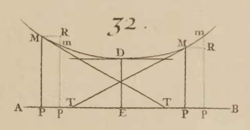
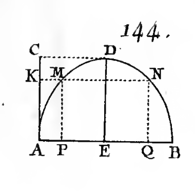

# Implications of Differentiability




This section uses these add-on packages:


```{julia}
using CalculusWithJulia
using Plots
plotly()
using Roots
```

```{julia}
#| echo: false
#| results: "hidden"
using Printf
using SymPy
nothing
```

---


Supposed $\epsilon_h$ is some function going to $0$ as $h \rightarrow 0$ that may be different from line to line. Then we have two somewhat similar characterizations of continuity and differentiability:


A function is *continuous* at $c$ if

$$
f(c+h) - f(c) = \epsilon_h.
$$

A function is *differentiable* at $c$ if

$$
f(c+h) - f(c) - f'(c)h = \epsilon_h \cdot h.
$$


We defined a function to be *continuous* on an interval $I=(a,b)$ if it was continuous at each point $c$ in $I$. Similarly, we define a function to be *differentiable* on the interval $I$ if it is differentiable at each point $c$ in $I$.


This section looks at properties of differentiable functions. As there is a more stringent definition, perhaps more properties are a consequence of the definition.


## Differentiability implies continuity


Let $f$ be a differentiable function on $I=(a,b)$. We see that $f(c+h) - f(c) = f'(c)h + \epsilon_h\cdot h = h(f'(c) + \epsilon_h)$. The right hand side will clearly go to $0$ as $h\rightarrow 0$, so $f$ will be continuous. In short:

::: {.relationship title="Differentiable implies continuous"}

A differentiable function on $I=(a,b)$ is continuous on $I$.

:::


Is it possible that all continuous functions are differentiable?


The fact that the derivative is related to the tangent line's slope might give an indication that this won't be the case - we just need a function which is continuous but has a point with no tangent line. The usual suspect is $f(x) = \lvert x\rvert$ at $0$, plotted around $0$ in @fig-plot-abs-over-minus1-1-not-diff-at-0.

::: {#fig-plot-abs-over-minus1-1-not-diff-at-0}
```{julia}
#| echo: false
f(x) = abs(x)
plot(f, -1,1)
```

Plot of $f(x) = \lvert x \rvert$ over $[-1, 1]$. This function does not have a tangent line at $x=0$.
:::

We can see formally that the secant line expression will not have a limit when $c=0$ (the left limit is $-1$, the right limit $1$). But more insight is gained by looking at the shape of the graph.  At the origin, the graph always is vee-shaped. There is no linear function that approximates this function well. The function is just not smooth enough, as it has a kink.


There are other functions that have kinks. These are often associated with powers. For example, at $x=0$ the function $f(x) = x^{2/3}$ (@fig-plot-x-2-thirds-over-minus1-1) will not have a derivative at $x=0$.

::: {#fig-plot-x-2-thirds-over-minus1-1}
```{julia}
#| echo: false
f(x) = (x^2)^(1/3)
plot(f, -1, 1)
```

Plot of $f(x) = x^{2/3}$ over $[-1, 1]$. This function does not have a tangent line at $x=0$.
:::

Other functions have tangent lines that become vertical. The natural slope would be $\infty$, but this isn't a limiting answer (except in the extended sense we don't apply to the definition of derivatives). A candidate for this case is the cube root function, shown in @fig-cbrt-over-minus1-1-not-tangent-line-at-0.

::: {#fig-cbrt-over-minus1-1-not-tangent-line-at-0}
```{julia}
#| echo: false
plot(cbrt, -1, 1)
```

Plot of `cbrt` over $[-1,1]$. The "tangent" line at $x=0$ is vertical; the function is not differentiable at $0$
:::

The derivative at $0$ would need to be $+\infty$ to match the graph. This is implied by the formula for the derivative from the power rule: $f'(x) = 1/3 \cdot x^{-2/3}$, which has a vertical asymptote at $x=0$.


:::{.callout-note}
## Note
The `cbrt` function is used to plot @fig-cbrt-over-minus1-1-not-tangent-line-at-0}, instead of `f(x) = x^(1/3)`, as the latter is not defined for negative `x`. Though it can be for the exact power `1/3`, it can't be for an exact power like `1/2`. This means the value of the argument is important in determining the type of the output - and not just the type of the argument. Having type-stable functions is part of the magic to making `Julia` run fast, so `x^c` is not defined for negative `x` and most floating point exponents.

:::

Lest you think that continuous functions always have derivatives except perhaps at exceptional points, this isn't the case. The functions used to [model](http://tinyurl.com/cpdpheb) the stock market are continuous but have **no** points where they are differentiable.


## Fermat's theorem


We have defined an *absolute maximum* of $f(x)$ over an interval to be a value $f(c)$ for a point $c$ in the interval that is as large as any other value in the interval. Just specifying a function and an interval does not guarantee an absolute maximum, but specifying a *continuous* function and a *closed* interval does, by the extreme value theorem.


::: {.definition title="A relative maximum"}

We say $f(x)$ has a *relative maximum* at $c$ if there exists *some* interval $I=(a,b)$ with $a < c < b$ for which $f(c)$ is an absolute maximum for $f$ and $I$.

:::

The difference is a bit subtle, for an absolute maximum the interval must also be specified, for a relative maximum there just needs to exist some interval, possibly really small, though it must be bigger than a point.


:::{.callout-note}
## Note
A hiker can appreciate the difference. A relative maximum would be the crest of any hill, but an absolute maximum would often be the summit.

:::

What does this have to do with derivatives?

A theorem attributed to [Fermat](https://digitalcommons.ursinus.edu/cgi/viewcontent.cgi?params=/context/triumphs_calculus/article/1011/&path_info=M05_Fermats_Method_for_Finding_Maxima_and_Minima_2022_05_17.pdf) says something about where a relative or absolute maximum (or minimum) can occur under assumptions:

::: {.theorem title="Fermat's theorem"}

If a differentiable function on $(a,b)$ has a maximum at $c$ with $a < c < b$ then $f'(c) = 0$

:::


Relaxing differentibility to continuity, we have

::: {.relationship title="The derivative at a relative maximum"}

If a continuous function on $(a,b)$ has a maximum at $c$ with $a < c < b$ then $f'(c) = 0$ or the derivative of $f$ at $c$ does not exist.

:::


For a continuous function $f(x)$, call a point $c$ in the domain of $f$ where either $f'(c)=0$ or the derivative does not exist a **critical** **point**.

We can combine Bolzano's extreme value theorem with Fermat's insight to get the following:

::: {.relationship title="Absolute maxima characterization"}

A continuous function on $[a,b]$ has an absolute maximum that occurs at a critical point $c$, $a < c < b$, or an endpoint, $a$ or $b$.

A similar statement holds for an absolute minimum.
:::


The above gives a restricted set of places to look for absolute maximum and minimum values---all the critical points and the endpoints, but no where else.

It is the case that all relative extrema occur at a critical point, *however* it is *not* the case that all critical points correspond to relative extrema. We will see *derivative tests* that help characterize when a critical point corresponds to a relative extrema.


```{julia}
#| hold: true
#| echo: false
### {{{lhopital_32}}}
imgfile = "figures/lhopital-32.png"
caption =  L"""
Image number ``32`` from L'Hospitals calculus book (the first) showing that
at a relative minimum, the tangent line is parallel to the
$x$-axis. This of course is true when the tangent line is well defined
by Fermat's observation.
"""
# ImageFile(:derivatives, imgfile, caption)
nothing
```

::: {#fig-lhospital-image-number-32}
{fig-alt="Image number 32 of L'Hospital's book"}

Image number $32$ from L'Hospitals calculus book (the first) showing that
at a relative minimum, the tangent line is parallel to the
$x$-axis. This of course is true when the tangent line is well defined
by Fermat's observation.
:::


##### Example


For the function $f(x) = x^2 \cdot e^{-x}$ find the absolute maximum over the interval $[0, 5]$.


We have that $f(x)$ is continuous on the closed interval of the question, and in fact differentiable on $(0,5)$.  By differentiability, any critical point will be a zero of the derivative. We can check for these using `f'` to compute the derivative automatically:


```{julia}
f(x) = x^2 * exp(-x)
cps = find_zeros(f', -1, 6)     # find_zeros in `Roots`
```

We get $0$ and $2$ are critical points. The endpoints are $0$ and $5$. So the absolute maximum over this interval is either at $0$, $2$, or $5$:


```{julia}
f(0), f(2), f(5)
```

We see that $f(2)$ is then the maximum.


A few things. First, `find_zeros` can miss some roots, in particular endpoints and roots that just touch $0$. We should graph to verify it didn't. Second, it can be easier sometimes to check the values using the "dot" notation. If `f`, `a`,`b` are the function and the interval, then this would typically follow this pattern:


```{julia}
a, b = 0, 5
critical_pts = find_zeros(f', a, b)
f.(critical_pts), f(a), f(b)
```

For this problem, we have the left endpoint repeated, but in general this won't be a point where the derivative is zero.


As an aside, the output above is not a single container. To achieve that, the values can be combined before the broadcasting:


```{julia}
f.(vcat(a, critical_pts, b))
```

##### Example


For the function $g(x) = e^x\cdot(x^3 - x)$ find the  absolute maximum over the interval $[0, 2]$.


We follow the same pattern. Since $f(x)$ is continuous on the closed interval and differentiable on the open interval we know that the absolute maximum must occur at an endpoint ($0$ or $2$) or a critical point where $f'(c)=0$. To solve for these, we have again:


```{julia}
g(x) = exp(x) * (x^3 - x)
gcps = find_zeros(g', 0, 2)
```

And checking values gives:


```{julia}
g.(vcat(0, gcps, 2))
```

Here the maximum occurs at an endpoint. The critical point $c=0.67\dots$ does not produce a maximum value. Rather $f(0.67\dots)$ is an absolute minimum.


:::{.callout-note}
## Note

**Absolute minimum** We haven't discussed the parallel problem of   absolute minima over a closed interval. By considering the function   $h(x) = - f(x)$, we see that the any thing true for an absolute   maximum should hold in a related manner for an absolute minimum, in   particular an absolute minimum on a closed interval will only occur   at a critical point or an end point.

:::


## Rolle's theorem


Let $f(x)$ be differentiable on $(a,b)$ and continuous on $[a,b]$. Then the absolute maximum occurs at an endpoint or where the derivative is $0$ (as the derivative is always defined). This gives rise to:

::: {.theorem title="Rolle's theorem"}

[Rolle's](http://en.wikipedia.org/wiki/Rolle%27s_theorem) theorem states that
if $f$ differentiable on $(a,b)$ and continuous on $[a,b]$ and if $f(a)=f(b)$, then there exists some $c$ in $(a,b)$ with $f'(c) = 0$.

:::

::: {#fig-l-hospital-144}

{ig-alt="Figure from L'Hospital's calculus book"}

Figure from L'Hospital's calculus book showing Rolle's theorem where $c=E$ in the labeling.
:::

This modest observation opens the door to many relationships between a function and its derivative, as it ties the two together in one statement.


To see why Rolle's theorem is true, we assume that $f(a)=0$, otherwise consider $g(x)=f(x)-f(a)$. By the extreme value theorem, there must be an absolute maximum and minimum. If $f(x)$ is ever positive, then the absolute maximum occurs in $(a,b)$---not at an endpoint---so at a critical point where the derivative is $0$. Similarly if $f(x)$ is ever negative. Finally, if $f(x)$ is just $0$, then take any $c$ in $(a,b)$.


The statement in Rolle's theorem speaks to existence. It doesn't give a recipe to find $c$. It just guarantees that there is *one* or *more* values in the interval $(a,b)$ where the derivative is $0$ if we assume differentiability on $(a,b)$ and continuity on $[a,b]$.


##### Example


Let $j(x) = e^x \cdot x \cdot (x-1)$. We know $j(0)=0$ and $j(1)=0$, so on $[0,1]$. Rolle's theorem guarantees that we can find *at* *least* one answer to $j'(x) = 0$ between $0$ and $1$. We see there is only the one numerically. @fig-plot-expx-times-x-times-x-minus-1-over-0-1 also illustrates graphically the lone value for $c$ in $[a,b]$ for this problem.


```{julia}
j(x) = exp(x) * x * (x-1)
find_zeros(j', 0, 1)
```


::: {#fig-plot-expx-times-x-times-x-minus-1-over-0-1}
```{julia}
#| echo: false
let
    gr()
    x0 = find_zero(j', (0, 1))
    j₀ = j(x0)
    plt = plot(; legend=false, framestyle=:origin)
    plot!(plt, [j, x->j₀ + 0*(x-x0)], 0, 1)
    scatter!(plt, [(x0, j₀)])
    annotate!(plt, [
        (0,0,text(L"a", :bottom, :left)),
        (x0, j₀, text(L"(c, f(c))", :bottom, :left)),
        (1, 0, text(L"b", :bottom))])
    plotly()
    plt
end
```

Plot of $f(x) = e^x \cdot x \cdot (x-1)$ over $[0,1]$ showing a single value $c$ satisfying Rolle's theorem
:::

## The mean value theorem


We are driving south and in one hour cover 70 miles. If the speed limit is 65 miles per hour, were we ever speeding? Well we averaged more than the speed limit so we know the answer is yes, but why? Speeding would mean our instantaneous speed was more than the speed limit, yet we only know for sure our *average* speed was more than the speed limit. The mean value tells us that if some conditions are met, then at some point (possibly more than one) we must have that our instantaneous speed is equal to our average speed.


The mean value theorem is a direct generalization of Rolle's theorem.

::: {.theorem title="Mean value theorem"}

Let $f(x)$ be differentiable on $(a,b)$ and continuous on $[a,b]$. Then there exists a value $c$ in $(a,b)$ where

$$
f'(c) = \frac{f(b) - f(a)}{b - a}.
$$

:::

This theorem says appropriate functions  the secant line between $a < b$  will have at least one parallel tangent line at a value $c$ with $a < c < b$.


@fig-mean-value-theorem illustrates the theorem. The secant line between $a$ and $b$ is dashed.  For this function there are two values of $c$ where the slope of the tangent line is seen to be the same as the slope of this secant line. At least one is guaranteed by the theorem.

::: {#fig-mean-value-theorem}
```{julia}
#| hold: true
#| echo: false
let
	# mean value theorem
    gr()
	f(x) = x^3 -4x^2 + 3x - 1
	a, b = -3/4, 3+3/4
	plot(; axis=([], nothing),
		 legend=false,
		 xlims=(-1.1,4),
		 framestyle=:none)
	y₀ = 0.3  + f(-1)

	plot!(f, -1, 4; line=(:black, 2))
	plot!([-1.1, 4], y₀*[1,1]; line=(:black, 1), arrow=true, head=:top)
	p,q = (a,f(a)), (b, f(b))
	scatter!([p,q]; marker=(:circle, 4, :red))
	plot!([p,q]; line=(:gray, 2, :dash))
	m = (f(b) - f(a))/(b-a)
	c₁, c₂ = find_zeros(x -> f'(x) - m, (a,b))

	Δ = 2/3
	for c ∈ (c₁, c₂)
		plot!(tangent(f,c), c-Δ, c+Δ; line=(:gray, 2))
		plot!([(c, y₀), (c, f(c))]; line=(:gray, 1, :dash))
	end

	for c ∈ (a,b)
		plot!([(c, y₀), (c, f(c))]; line=(:gray, 1))
	end

	annotate!([
		(a, y₀, text(L"a", :top)),
		(b, y₀, text(L"b", :top)),
		(c₁, y₀, text(L"c_1", :top)),
		(c₂, y₀, text(L"c_2", :top)),

	])

	current()


end
```

```{julia}
#| echo: false
plotly()
nothing
```

Figure illustrating the mean value theorem. The secant line from $(a,f(a))$ to $(b, f(b))$ is matched by two points $c$ in $(a,b)$ with parallel tangent lines
:::

Like Rolle's theorem this is a guarantee that something exists, not a recipe to find it. In fact, the mean value theorem is just Rolle's theorem applied to:


$$
g(x) = f(x) - (f(a) + (f(b) - f(a)) / (b-a) \cdot (x-a))
$$

That is the function $f(x)$, minus the secant line between $(a,f(a))$ and $(b, f(b))$.

::: {#fig-jsxgraph-mvt}
```{julia}
#| hold: true
#| echo: false
# Need to bring jsxgraph into PLUTO
#caption = """
#Illustration of the mean value theorem from
#[jsxgraph](https://jsxgraph.uni-bayreuth.de/).
#The polynomial function interpolates  the points ``A``,``B``,``C``, and ``D``.
#Adjusting these creates different functions. Regardless of the
#function -- which as a polynomial will always be continuous and
#differentiable -- the slope of the secant line between ``A`` and ``B`` is
#always matched by **some** tangent line between the points ``A`` and ``B``.
#"""
#JSXGraph(:derivatives, "mean-value.js", caption)
nothing
```

```{=html}
<div id="jsxgraph" style="width: 500px; height: 500px;"></div>
```

```{ojs}
//| echo: false
//| output: false

JXG = require("jsxgraph");

board = JXG.JSXGraph.initBoard('jsxgraph', {boundingbox: [-5, 10, 7, -6], axis:true});
p = [
  board.create('point', [-1,-2], {size:2}),
  board.create('point', [6,5], {size:2}),
  board.create('point', [-0.5,1], {size:2}),
  board.create('point', [3,3], {size:2})
];
f = JXG.Math.Numerics.lagrangePolynomial(p);
graph = board.create('functiongraph', [f,-10, 10]);

g = function(x) {
     return JXG.Math.Numerics.D(f)(x)-(p[1].Y()-p[0].Y())/(p[1].X()-p[0].X());
};

r = board.create('glider', [
                    function() { return JXG.Math.Numerics.root(g,(p[0].X()+p[1].X())*0.5); },
                    function() { return f(JXG.Math.Numerics.root(g,(p[0].X()+p[1].X())*0.5)); },
                    graph], {name:' ',size:4,fixed:true});
board.create('tangent', [r], {strokeColor:'#ff0000'});
line = board.create('line',[p[0],p[1]],{strokeColor:'#ff0000',dash:1});
```

Interactive graphic showing a parallel tangent line to $f(x) at $a < c < b$ can always be found that has the same slope as the secant line between $(a, f(a))$ and $(b, f(b))$
:::


The interactive example of @fig-jsxgraph-mvt can also be found at [jsxgraph](http://jsxgraph.uni-bayreuth.de/wiki/index.php?title=Mean_Value_Theorem). It shows a cubic polynomial fit to the $4$ adjustable points labeled A through D. The secant line is drawn between points A and B with a dashed line. A tangent line---with the same slope as the secant line---is identified at a point $(\alpha, f(\alpha))$ where $\alpha$ is between the points A and B. That this can always be done is a consequence of the mean value theorem.

##### Example

The function $f(x) = e^{-x^2/2}$ is continuously differentiable on $[0,1]$. That means the mean value theorem applies. Find a value $c$ satisfying the theorem.

The pattern is the same, we use `Roots` to solve an equation as follows:

```{julia}
f(x) = exp(-x^2/2)
a, b = 0, 1
m = (f(b) - f(a)) / (b - a)  # slope of secant line
h(x) = f'(x) - m             # solving f'(x) = m
find_zeros(h, (a, b))
```

The call to `find_zeros` returns just one value for $c$.

##### Example


The mean value theorem is an extremely useful tool to relate properties of a function with properties of its derivative, as, like Rolle's theorem, it includes both $f$ and $f'$ in its statement.


For example, suppose we have a function $f(x)$ and we know that the derivative is **always** $0$. What can we say about the function?


Well, constant functions have derivatives that are constantly $0$. But do others? We will see the answer is no: If a function has a zero derivative in $(a,b)$ it must be a constant.

We can readily see that if $f$ is a polynomial function this is the case, as we can differentiate a polynomial function and this will be zero only if **all** its coefficients are $0$, which would mean there is no non-constant leading term in the polynomial. But polynomials are not representative of all functions, and so a proof requires a bit more effort.


Suppose it is known that $f'(x)=0$ on some interval $I$ and we take any $a < b$ in $I$. Since $f'(x)$ always exists, $f(x)$ is always differentiable, and hence always continuous. So on $[a,b]$ the conditions of the mean value theorem apply. That is, there is a $c$ in $(a,b)$ with $(f(b) - f(a)) / (b-a) = f'(c) = 0$. But this would imply $f(b) - f(a)=0$. That is $f(x)$ is a constant, as for any $a$ and $b$, we see $f(a)=f(b)$.


### The Cauchy mean value theorem


[Cauchy](http://en.wikipedia.org/wiki/Mean_value_theorem#Cauchy.27s_mean_value_theorem) offered an extension to the mean value theorem.

::: {.theorem title="Cauchy mean value theorem"}

Suppose both $f$ and $g$ satisfy the conditions of the mean value theorem on $[a,b]$ with $g(b)-g(a) \neq 0$, then there exists at least one $c$ with $a < c < b$ such that


$$
f'(c)  = g'(c) \cdot \frac{f(b) - f(a)}{g(b) - g(a)}.
$$

:::

The proof follows by considering $h(x) = f(x) - r\cdot g(x)$, with $r$ chosen so that $h(a)=h(b)$. Then Rolle's theorem applies so that there is a $c$ with $h'(c)=0$, so $f'(c) = r g'(c)$, but $r$ can be seen to be $(f(b)-f(a))/(g(b)-g(a))$, which proves the theorem.


Letting $g(x) = x$ demonstrates that the mean value theorem is a special case.


##### Example


Suppose $f(x)$ and $g(x)$ satisfy the Cauchy mean value theorem on $[0,x]$, $g'(x)$ is non-zero on $(0,x)$, and $f(0)=g(0)=0$. Then we have:


$$
\frac{f(x) - f(0)}{g(x) - g(0)} = \frac{f(x)}{g(x)} = \frac{f'(c)}{g'(c)},
$$

For some $c$ in $[0,x]$. If $\lim_{x \rightarrow 0} f'(x)/g'(x) = L$, then the right hand side will have a limit of $L$, and hence the left hand side will too. That is, when the limit exists, we have under these conditions that $\lim_{x\rightarrow 0}f(x)/g(x) = \lim_{x\rightarrow 0}f'(x)/g'(x)$.


This could be used to prove the limit of $\sin(x)/x$ as $x$ goes to $0$ just by showing the limit of $\cos(x)/1$ is $1$, as is known by continuity.


##### Example: visualizing the Cauchy mean value theorem


The Cauchy mean value theorem can be visualized in terms of a tangent line and a *parallel* secant line in a similar manner as the mean value theorem as long as a *parametric* graph is used. A parametric graph plots the points $(g(t), f(t))$ for some range of $t$. That is, it graphs *both* functions at the same time. The following illustrates the construction of such a graph:

::: {#fig-illustrate-cauchy-mean-value-theore}
```{julia}
#| hold: true
#| echo: false
#| cache: true
### {{{parametric_fns}}}
gr()


function parametric_fns_graph(n)
    f = (x) -> sin(x)
    g = (x) -> x

    ns = (1:10)/10
    ts = range(-pi/2, stop=-pi/2 + ns[n] * pi, length=100)

    plt = plot(f, g, -pi/2, -pi/2 + ns[n] * pi, legend=false, size=fig_size,
               xlim=(-1.1,1.1), ylim=(-pi/2-.1, pi/2+.1))
    scatter!(plt, [f(ts[end])], [g(ts[end])], color=:orange, markersize=5)
    val = @sprintf("% 0.2f", ts[end])
    annotate!(plt, [(0, 1, L"t = %$val")])
end
caption = ""


n = 10
anim = @animate for i=1:n
    parametric_fns_graph(i)
end

imgfile = tempname() * ".gif"
gif(anim, imgfile, fps = 1)
plotly()
ImageFile(imgfile, caption)
```

Illustration of parametric graph of $(g(t), f(t))$ for $-\pi/2 \leq t
\leq \pi/2$ with $g(x) = \sin(x)$ and  $f(x) = x$. Each point on the
graph is from some value $t$ in the interval. We can see that the
graph goes through $(0,0)$ as that is when $t=0$. As well, it must go
through $(1, \pi/2)$ as that is when $t=\pi/2$

:::

With $g(x) = \sin(x)$ and $f(x) = x$, we can take $I=[a,b] = [0, \pi/2]$. In the @fig-mvt-two-c-exists-for-sinx, the *secant line* is drawn in red which connects $(g(a), f(a))$ with the point $(g(b), f(b))$, and hence has slope $\Delta f/\Delta g$. The parallel lines drawn show the *tangent* lines with slope $f'(c)/g'(c)$. Two exist for this problem, the mean value theorem guarantees at least one will.

::: {#fig-mvt-two-c-exists-for-sinx}
```{julia}
#| hold: true
#| echo: false
g(x) = sin(x)
f(x) = x
ts = range(-pi/2, stop=pi/2, length=50)
a,b = 0, pi/2
m = (f(b) - f(a))/(g(b) - g(a))
cps = find_zeros(x -> f'(x)/g'(x) - m, -pi/2, pi/2)
c = cps[1]
Delta = (0 + m * (c - 0)) - (g(c))

p = plot(g, f, -pi/2, pi/2, linewidth=3, legend=false)
plot!(x -> f(a) + m * (x - g(a)), -1, 1, linewidth=3, color=:red)
scatter!([g(a),g(b)], [f(a), f(b)])
for c in cps
  plot!(x -> f(c) + m * (x - g(c)), -1, 1, color=:orange)
end

p
```

Illustration of the Cauchy mean value theorem
:::

## Questions


###### Question


Rolle's theorem is a guarantee of a value, but does not provide a recipe to find it. For the function $1 - x^2$ over the interval $[-5,5]$, find a value $c$ that satisfies the result.


```{julia}
#| hold: true
#| echo: false
c = 0
numericq(c)
```

###### Question


The extreme value theorem is a guarantee of a value, but does not provide a recipe to find it. For the function $f(x) = \sin(x)$ on $I=[0, \pi]$ find a value $c$ satisfying the theorem for an absolute maximum.


```{julia}
#| hold: true
#| echo: false
c = pi/2
numericq(c)
```

###### Question


The extreme value theorem is a guarantee of a value, but does not provide a recipe to find it. For the function $f(x) = \cos(x)$ on $I=[\pi, 3\pi/2]$ find a value $c$ in $I$ for which $f(x)$ has its maximum value.


```{julia}
#| hold: true
#| echo: false
c = 3pi/2
numericq(c)
```

###### Question


The mean value theorem is a guarantee of a value, but does not provide a recipe to find it. For $f(x) = x^2$ on $[0,2]$ find a value of $c$ satisfying the theorem.


```{julia}
#| hold: true
#| echo: false
c = 1
numericq(c)
```

###### Question


The Cauchy mean value theorem is a guarantee of a value, but does not provide a recipe to find it. For $f(x) = x^3$ and $g(x) = x^2$ find a value $c$ in the interval $[1, 2]$


```{julia}
#| hold: true
#| echo: false
c,x = symbols("c, x", real=true)
val = solve(3c^2 / (2c) - (2^3 - 1^3) / (2^2 - 1^2), c)[1]
numericq(float(val))
```

###### Question


Let $f(x) = 1/x$. For $0 < a < b$, find $c$ so that $f'(c) = (f(b) - f(a)) / (b-a)$.


```{julia}
#| hold: true
#| echo: false
choices = [
"``c = (a+b)/2``",
"``c = \\sqrt{ab}``",
"``c = 1 / (1/a + 1/b)``",
"``c = a + (\\sqrt{5} - 1)/2 \\cdot (b-a)``"
]
answ = 2
radioq(choices, answ)
```

###### Question


Let $f(x) = x^2$. For $0 < a < b$, find $c$ so that $f'(c) = (f(b) - f(a)) / (b-a)$.


```{julia}
#| hold: true
#| echo: false
choices = [
"``c = (a+b)/2``",
"``c = \\sqrt{ab}``",
"``c = 1 / (1/a + 1/b)``",
"``c = a + (\\sqrt{5} - 1)/2 \\cdot (b-a)``"
]
answ = 1
radioq(choices, answ)
```

###### Question


Will the function $f(x) = x + 1/x$ satisfy the conditions of the mean value theorem over $[-1/2, 1/2]$?


```{julia}
#| hold: true
#| echo: false
radioq(["Yes", "No"], 2)
```

###### Question


Just as it is a fact that $f'(x) = 0$ (for all $x$ in $I$) implies $f(x)$ is a constant, so too is it a fact that if $f'(x) = g'(x)$ that $f(x) - g(x)$ is a constant. What function would you consider, if you wanted to prove this with the mean value theorem?


```{julia}
#| hold: true
#| echo: false
choices = [
"``h(x) = f(x) - (f(b) - f(a)) / (b - a)``",
"``h(x) = f(x) - (f(b) - f(a)) / (b - a) \\cdot g(x)``",
"``h(x) = f(x) - g(x)``",
"``h(x) = f'(x) - g'(x)``"
]
answ = 3
radioq(choices, answ)
```

###### Question


Suppose $f''(x) > 0$ on $I$. Why is it impossible that $f'(x) = 0$ at more than one value in $I$?


```{julia}
#| hold: true
#| echo: false
choices = [
L"It isn't. The function $f(x) = x^2$ has two zeros and $f''(x) = 2 > 0$",
"By the Rolle's theorem, there is at least one, and perhaps more",
L"By the mean value theorem, we must have $f'(b) - f'(a) > 0$ whenever $b > a$. This means $f'(x)$ is increasing and can't double back to have more than one zero."
]
answ = 3
radioq(choices, answ)
```


###### Question


In an example, we used the fact that if $0 < c < x$, for some $c$ given by the mean value theorem and $f(x)$ goes to $0$ as $x$ goes to zero then $f(c)$ will also go to zero. As $c$ depends on $x$, suppose we write $c=g(x)$ for some function $g$.


Why is it known that $g(x)$ goes to $0$ as $x$ goes to zero (from the right)?


```{julia}
#| hold: true
#| echo: false
choices = [L"The squeeze theorem applies, as $0 < g(x) < x$.",
L"As $f(x)$ goes to zero by Rolle's theorem it must be that $g(x)$ goes to $0$.",
L"This follows by the extreme value theorem, as there must be some $c$ in $[0,x]$."]
answ = 1
radioq(choices, answ)
```

Since $g(x)$ goes to zero, why is it true that if $f(x)$ goes to $L$ as $x$ goes to zero that $f(g(x))$ must also have a limit $L$?


```{julia}
#| hold: true
#| echo: false
choices = ["It isn't true. The limit must be 0",
L"The squeeze theorem applies, as $0 < g(x) < x$",
"This follows from the limit rules for composition of functions"]
answ = 3
radioq(choices, answ)
```


##### Question

[Fermat](https://digitalcommons.ursinus.edu/cgi/viewcontent.cgi?params=/context/triumphs_calculus/article/1011/&path_info=M05_Fermats_Method_for_Finding_Maxima_and_Minima_2022_05_17.pdf) didn't exactly prove his theorem in the language of today. Rather, following Monks, we quote

> Let a be the desired unknown, whether it be a length, a plane region or a solid, depending
> on what the given magnitude equals, and let its maximum or minimum be found in terms of
> $a$, involving whatever degree. Replace this first quantity with $a + e$, and the maximum or
> minimum will be found in terms of $a$ and $e$, with coefficients of whatever degree. These two
> representations of the maximum or minimum are adequated, to use Diophantus’ term,
> and the common terms are subtracted. Having done this, all terms from either part (affected by
> $e$ or its powers) are divided each by $e$, or by a higher power of the same, until some term of
> one or the other of the expressions is altogether freed from being affected by $e$.
>
> All terms involving $e$ or one of its powers are then eliminated and the remaining terms
> are equated; or, should one of the expressions be left as nothing, then the positive terms
> are equated with the negatives, which reduces to the same thing. The solution to this last
> equation will yield the value of $a$, which will reveal knowledge of the maximum or minimum

Huh? As an example,  he considered a line segment $AC$ and a point $E$ with the task of choosing $E$ so that $(E-A) \times (C-E)$ being a maximum.

::: {#fig-fermat-line-segment}
```{julia}
#| echo: false

let
    gr()
    A, E, C = (0,0), (1, 0), (3, 0)
    plt = plot(; empty_style...)
    plot!(plt, [A,C]; line=(1, :black))
    tck = (0, 0.1)
    for P ∈ (A, E, C)
        plot!(plt, [P, P .+ tck], line=(1, :black))
    end
    annotate!(plt, [
        (A..., text(L"A", :top)),
        (E..., text(L"E", :top)),
        (C..., text(L"C", :top))])
    plotly()
    plt
end
```

$AC$ is a line divided at $E$ so that $AE \times EC$ is maximum
::::


Set $b=AC$ and $a = AE$ then the product is $a \cdot (b-a)$. the point was at $a + e$, then the product would be $(a+e) \cdot (b - a - e)$. The term *adequated* means approximately equal gives what?

```{julia}
#| echo: false
choices = [L"a \cdot(b-a) - a \cdot (b-a) = 0",
           L"a \cdot(b-a) - (a + e) \cdot (b- (a - e)) \approx 0"]
answer = 2
buttonq(choices, answer)
```

Next we divide by $e$---or a higher power of $e$---and simplify so that some term has not $e$ in it.

For this case, does this satisfy the above?

$$
\frac{(a \cdot (b-a) - (a + e)\cdot(b - (a + e))}{e} = 2a - b + e
$$

```{julia}
#| echo: false
choices = ["Yes", "No"]
answer = 1
buttonq(choices, answer)
```

The value $b - 2a = 0$ gives $a = $b/2$. Is this true: geometrically, we know this to be at the midpoint, as the equation is a parabola.


```{julia}
#| echo: false
choices = ["Yes", "No"]
answer = 1
buttonq(choices, answer)
```
