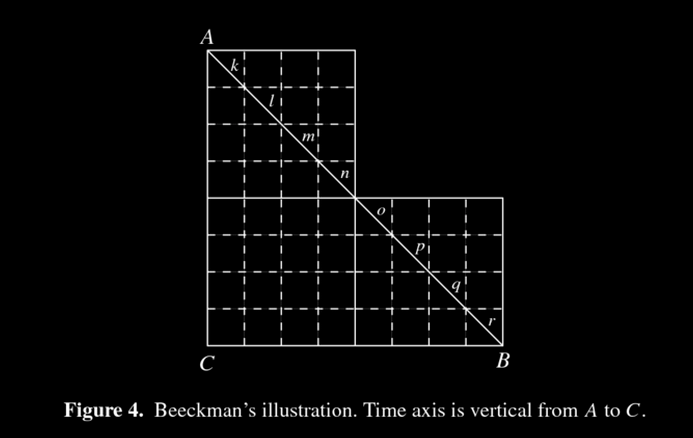

# Area under a curve




This section uses these add-on packages:


```{julia}
using CalculusWithJulia
using Plots; plotly()
using Roots
```

```{julia}
#| echo: false
# for problems
using QuadGK
nothing
```

---

::: {#fig-jigsaw-puzzle}


When completed, a jigsaw puzzle fills a certain amount of area. For a traditional rectangular puzzle this area can be computed using base times height, but could also be found by adding the areas of each piece. Decomposing a total area into the sum of smaller areas---even if only approximate---is the basis of definite integration.
:::


The question of area has long fascinated human culture. As children, we learn early on the formulas for the areas of some geometric figures: a square is $b^2$, a rectangle $b\cdot h$, a triangle $1/2 \cdot b \cdot h$ and for a circle, $\pi r^2$. The area of a rectangle is often the intuitive basis for illustrating multiplication. The area of a triangle has been known for ages. Even complicated expressions, such as [Heron's](http://tinyurl.com/mqm9z) formula which relates the area of a triangle with measurements from its perimeter have been around for 2000 years. The formula for the area of a circle is also quite old. Wikipedia dates it as far back as the [Rhind](http://en.wikipedia.org/wiki/Rhind_Mathematical_Papyrus) papyrus for 1700 BC, with the approximation of $256/81$ for $\pi$.


The calculus approach to computing areas begins with a non-negative function $f(x)$ over an interval $[a,b]$. The goal is to compute the area under the graph of $f(x)$. That is, the area between $f(x)$ and the $x$-axis for $a \leq x \leq b$.


For some functions this area can be computed by familiar geometry. Examples are shown in @fig-easy-to-compute-areas.
But what of more complicated areas? Can these have their area computed?


::: {#fig-easy-to-compute-areas layout-ncol=2}
```{julia}
#| echo: false
gr();
```

```{julia}
#| echo: false
let
    f(x) = 1 - abs(x)
    plot(; legend=false, xlims=(-5/4, 5/4))
    plot!(f; line=(1, :black))
    plot!(zero; line=(1, :black))
    plot!(f, -1, 1; line=(5, :black, 0.25))
    plot!(zero, -1, 1; line=(5, :black, 0.25))
end
```

```{julia}
#| hold: true
#| echo: false
let
    f(x) = 1
    plot(; legend=false, xlims=(-1/4, 5/4))
    plot!(f; line=(1, :black))
    plot!(zero; line=(1, :black))
    plot!([(0,0), (1,0), (1,1), (0,1), (0,0)]; line=(5, :black, 0.25))
end
```

```{julia}
#| hold: true
#| echo: false
let
    f(x) = sqrt(1 - x^2)
    plot(; legend=false, xlims=(-5/4, 5/4), aspect_ratio=:equal)
    plot!(f, -1, 1; line=(1,:black))
    plot!(f, -1, 1; line=(5,:black, 0.25))
    plot!(zero; line=(1, :black))
    plot!(zero, -1, 1; line=(5, :black, 0.25))
end
```

```{julia}
#| hold: true
#| echo: false
let
    f(x) = x > 1 ? 2 - x : 1.0
    plot(; legend=false, xlims=(-1/4, 2 + 1/4), aspect_ratio=:equal)
    plot!(f; line=(1, :black))
    plot!(f, 0, 2; line=(5, :black, 0.25))
    plot!(zero; line=(1, :black))
    plot!(zero, 0, 2; line=(5, :black, 0.25))
    plot!([(0,0), (0, 1)]; line=(5, :black, 0.25))
end
```

```{julia}
#| echo: false
plotly();
```

Example of areas under functions over an interval that can readily be computed. The upper left shows the area under $1 - \lvert x \rvert$ over $[-1,1]$ (a triangle); the upper right shows the area under $f(x) = 1$ over $[0,1]$ (a square); the lower left shows the area under $\sqrt{1 - x^2}$ over $[-1,1]$ (a half circle); and the lower right graph shows an area comprised of a square and a triangle.
:::

## Approximating areas


::: {#fig-archimedes-parabola-take-2}
```{julia}
#| hold: true
#| echo: false
## {{{archimedes_parabola}}}
gr()

f(x) = x^2
colors = [:black, :blue, :orange, :red, :green, :orange, :purple]

## Area of parabola
function make_triangle_graph(n)
    title = "Area of parabolic cup ..."
    n==1 && (title = L"Area $= 1/2$")
    n==2 && (title = L"Area $=$ previous $+\; \frac{1}{8}$")
    n==3 && (title = L"Area $=$ previous $+\; 2\cdot\frac{1}{8^2}$")
    n==4 && (title = L"Area $=$ previous $+\; 4\cdot\frac{1}{8^3}$")
    n==5 && (title = L"Area $=$ previous $+\; 8\cdot\frac{1}{8^4}$")
    n==6 && (title = L"Area $=$ previous $+\; 16\cdot\frac{1}{8^5}$")
    n==7 && (title = L"Area $=$ previous $+\; 32\cdot\frac{1}{8^6}$")


    plt = plot(f, 0, 1;
			   legend=false,
			   size = fig_size,
			   linewidth=2)
    annotate!(plt, [
		(0.05, 0.9, text(title,:left))
	])  # if in title, it grows funny with gr
    n >= 1 && plot!(plt, [1,0,0,1, 0], [1,1,0,1,1];
					color=colors[1], linetype=:polygon,
					fill=colors[1], alpha=.2)
    n == 1 && plot!(plt, [1,0,0,1, 0], [1,1,0,1,1];
					color=colors[1], linewidth=2)
    for k in 2:n
        xs = range(0, stop=1, length=1+2^(k-1))
        ys = f.(xs)
        k < n && plot!(plt, xs, ys;
					   linetype=:polygon, fill=:black, alpha=.2)
        if k == n
            plot!(plt, xs, ys;
				  color=colors[k], linetype=:polygon, fill=:black, alpha=.2)
            plot!(plt, xs, ys;
				  color=:black, linewidth=2)
        end
    end
    plt
end

n = 7
anim = @animate for i=1:n
    make_triangle_graph(i)
end

imgfile = tempname() * ".gif"
gif(anim, imgfile, fps = 1)


caption = ""
plotly()
ImageFile(imgfile, caption)
```

The first triangle has area $1/2$, the second has area $1/8$, then $2$ have area $(1/8)^2$, $4$ have area $(1/8)^3$, ... With some algebra, the total area then should be $1/2 \cdot (1 + (1/4) + (1/4)^2 + \cdots) = 2/3$.
:::


In a previous section, we saw the animation in @fig-archimedes-parabola-take-2. This animation illustrates a method of [Archimedes](http://en.wikipedia.org/wiki/The_Quadrature_of_the_Parabola) to compute the area contained in a parabola using the method of exhaustion. The area below the curve, just a subtraction away. Archimedes leveraged a fact he discovered relating the areas of triangle inscribed with parabolic segments to create a sum that could be computed.


The pursuit of computing areas persisted. The method of computing area by finding a square with an equivalent area was known as *quadrature*. Over the years, many figures had their area computed, for example, the area under the graph of the [cycloid](http://en.wikipedia.org/wiki/Cycloid) (...Galileo tried empirically to find this using a tracing on sheet metal and a scale).


However, as areas of geometric objects were replaced by the more general question of area related to graphs of functions, a more general study was called for.


One such approach is illustrated in @fig-beeckman-1618 due to Beeckman from 1618.

::: {#fig-beeckman-1618}
```{julia}
#| echo: false
imgfile = "figures/beeckman-1618.png"
caption = L"""

Figure of Beeckman (1618) showing a means to compute the area under a
curve, in this example the line connecting points $A$ and $B$. Using
approximations by geometric figures with known area is the basis of
Riemann sums.

"""
#ImageFile(:integrals, imgfile, caption)
nothing
```



Figure of Beeckman (1618) showing a means to compute the area under a
curve, in this example the line connecting points $A$ and $B$. Using
approximations by geometric figures with known area is the basis of
Riemann sums.  (from [Bressoud](http://www.math.harvard.edu/~knill/teaching/math1a_2011/exhibits/bressoud/))
:::

Beeckman actually did more than find the area. He generalized the relationship of rate $\times$ time $=$ distance. The line was interpreting a velocity, the "squares", then, provided an approximate distance traveled when the velocity is taken as a constant on the small time interval. Then the distance traveled can be approximated by a smaller quantity---just add the area of the squares within the desired area ($6+16+6$)---and a larger quantity---by including all the squares that have a portion of their area within the desired area ($10 + 16 + 10$). Beeckman argued that the error vanishes as the squares get smaller and smaller.


Adding up the smaller "squares" can be a bit more efficient if we were to add all those in a row, or column at once. We would then add the areas of a smaller number of rectangles. For this curve, the two approaches are basically identical. For other curves, identifying which squares in a row would be added is much more complicated (though useful), but for a curve generated by a function, identifying which "squares" go in a rectangle is quite easy, in fact we can see the rectangle's area will be a base given by that of the squares, and height depending on the function.


### Adding rectangles


The idea of the Riemann sum is to approximate the area under the curve of a non-negative function by the area of well-chosen rectangles in such a way that as the bases of the rectangles get smaller (hence adding more rectangles) the error in approximation vanishes.


Define a partition of $[a,b]$ to be a selection of points $a = x_0 < x_1 < \cdots < x_{n-1} < x_n = b$. The norm of the partition is the largest of all the differences $\lvert x_i - x_{i-1} \rvert$. For a partition, consider an arbitrary selection of points $c_i$ satisfying $x_{i-1} \leq c_i \leq x_{i}$, $1 \leq i \leq n$. Then the following is a **Riemann sum**:


$$
S_n = f(c_1) \cdot (x_1 - x_0) + f(c_2) \cdot (x_2 - x_1) + \cdots + f(c_n) \cdot (x_n - x_{n-1}).
$$

Clearly for a given partition and choice of $\{c_i\}$, the above can be computed. Each term $f(c_i)\cdot(x_i-x_{i-1}) = f(c_i)\Delta_i$ can be visualized as the area of a rectangle with base spanning from $x_{i-1}$ to $x_i$ and height given by the function value at $c_i$. @fig-left-riemann-sum-animation visualizes *left* Riemann sums for different values of $n$ in a way that makes Beekman's intuition plausible---that as the number of rectangles gets larger, the approximate sum will get closer to the actual area.

::: {#fig-left-riemann-sum-animation}
```{julia}
#| hold: true
#| echo: false
gr()

function left_riemann(n)
		empty_style = (xaxis=([], false),
                    yaxis=([], false),
                    framestyle=:origin,
                    legend=false)
	axis_style = (arrow=true, side=:head, line=(:gray, 1))
	rectangle = (x, y, w, h) -> Shape(x .+ [0,w,w,0], y .+ [0,0,h,h])

	f = x -> -(x+1/2)*(x-1)*(x-3) + 1
	a, b= 1, 3

	plot(; empty_style...)
	plot!(f, a, b; line=(:black, 3))
	plot!([a-.25, b+.25], [0,0]; axis_style...)
	plot!([a-.1, a-.1], [-.25, .5 + f(a/2 +b/2)]; axis_style...)

	Δ = (b-a)/n
	for i ∈ 0:n-1
		xᵢ = a + i*Δ
		plot!(rectangle(xᵢ, 0, Δ, f(xᵢ)), opacity=0.5, color=:red)
	end
	area = round(sum(f(a + i*Δ)*Δ for i ∈ 0:n-1), digits=3)

	annotate!([
		(a, 0, text(L"a", :top)),
		(b, 0, text(L"b", :top)),
		(a, f(a/2+b/2), text("\$L_{$n} = $area\$", :left))
	])

	current()
end

#=
rectangle(x, y, w, h) = Shape(x .+ [0,w,w,0], y .+ [0,0,h,h])
function ₙ(j)
	a = ("₋","","","₀","₁","₂","₃","₄","₅","₆","₇","₈","₉")
	join([a[Int(i)-44]  for i in string(j)])
end

function left_riemann(n)
	f = x -> -(x+1/2)*(x-1)*(x-3) + 1
	p = plot(f, 1, 3, legend=false, linewidth=5)
	a, b= 1, 3
	Δ = (b-a)/n
	for i ∈ 0:n-1
		xᵢ = a + i*Δ
		plot!(rectangle(xᵢ, 0, Δ, f(xᵢ)), opacity=0.5, color=:red)
	end
	a = round(sum(f(a + i*Δ)*Δ for i ∈ 0:n-1), digits=3)

	title!("L$(ₙ(n)) = $a")
	p
end
=#

anim = @animate for i ∈ (2,4,8,16,32,64)
    left_riemann(i)
end

imgfile = tempname() * ".gif"
gif(anim, imgfile, fps = 1)

caption = ""

plotly()
ImageFile(imgfile, caption)
```

Illustration of left Riemann sum for increasing ``n`` values
:::

To successfully compute a good approximation for the area, we would need to choose $c_i$ and the partition so that a formula can be found to express the dependence on the size of the partition.


For Archimedes' problem---finding the area under $f(x)=x^2$ between $0$ and $1$---if we take as a partition $x_i = i/n$ and $c_i = x_i$, then the above sum becomes:


$$
\begin{align*}
S_n &= f(c_1) \cdot (x_1 - x_0) + f(c_2) \cdot (x_2 - x_1) + \cdots + f(c_n) \cdot (x_n - x_{n-1})\\
&= (x_1)^2 \cdot \frac{1}{n} + (x_2)^2 \cdot \frac{1}{n} + \cdots + (x_n)^2 \cdot \frac{1}{n}\\
&= 1^2 \cdot \frac{1}{n^3}  + 2^2 \cdot \frac{1}{n^3} + \cdots + n^2 \cdot \frac{1}{n^3}\\
&= \frac{1}{n^3} \cdot (1^2 + 2^2 + \cdots + n^2) \\
&= \frac{1}{n^3} \cdot \frac{n\cdot(n-1)\cdot(2n+1)}{6}.
\end{align*}
$$


The latter uses a well-known formula for the sum of squares of the first $n$ natural numbers.


With this expression, it is readily seen that as $n$ gets large this value gets close to $2/6 = 1/3$.


:::{.callout-note}
## Note
The above approach, like Archimedes', ends with a limit being taken. The answer comes from using a limit to add a big number of small values. As with all limit questions, worrying about whether a limit exists is fundamental. For this problem, we will see that for the general statement there is a stretching of the formal concept of a limit.

:::

There is a more compact notation to $x_1 + x_2 + \cdots + x_n$, this using the *summation notation* or capital sigma. We have:


$$
\sum_{i = 1}^n x_i = x_1 + x_2 + \cdots + x_n.
$$

The notation includes three pieces of information:


* The $\sum$ is an indication of a sum.

* The ${i=1}$ and $n$ sub- and superscripts indicate the range to sum over.

* The term $x_i$ is a general term describing the $i$th entry, where it is understood that $i$ is just some arbitrary indexing value.


With this notation, a Riemann sum can be written  as

$$
\sum_{i=1}^n f(c_i)(x_i-x_{i-1}).
$$


### Other sums


The choice of the $c_i$ will give different answers for the approximation, though for an integrable function these differences will vanish in the limit. Some common choices are:


* Using the right hand endpoint of the interval $[x_{i-1}, x_i]$ giving the right-Riemann sum, $R_n$.

* The choice $c_i = x_{i-1}$ gives the left-Riemann sum, $L_n$.

* The choice $c_i = (x_i + x_{i-1})/2$ is the midpoint rule, $M_n$.

* If the function is continuous on the closed subinterval $[x_{i-1}, x_i]$, then it will take on its minimum and maximum values. By the extreme value theorem, we could take $c_i$ to correspond to either the maximum or the minimum. These choices give  the "upper Riemann-sums" and "lower Riemann-sums". When the area is well defined, it must lay between these two values for any given partition.


The choice of partition can also give different answers. A common choice is to break the interval into $n$ equal-sized pieces. With $\Delta = (b-a)/n$, the partition becomes the arithmetic sequence $a = a + 0 \cdot \Delta < a + 1 \cdot \Delta < a + 2 \cdot \Delta < \cdots < a + n \cdot  \Delta = b$ with $x_i = a + i (b-a)/n$. (The `range(a, b, length=n+1)` command will compute these.) An alternate choice made below for one problem is to use a geometric progression:


$$
a = a(1+\alpha)^0 < a(1+\alpha)^1 < a (1+\alpha)^2 < \cdots < a (1+\alpha)^n = b.
$$

The general statement allows for any partition provide the largest gap goes to $0$.


---


Riemann sums weren't named after Riemann because he was the first to approximate areas using rectangles. Indeed, others had been using even more efficient ways to compute areas for  centuries prior to Riemann's work. Rather, Riemann put the definition of the area under the curve on a firm theoretical footing with the following theorem which gives a concrete notion of what functions are integrable:


::: {.definition title="Riemann integral"}

A function $f$ is Riemann integrable over the interval $[a,b]$ and its integral will have value $A$ provided for every $\epsilon > 0$ there exists a $\delta > 0$ such that for any partition $a =x_0 < x_1 < \cdots < x_n=b$ with $\lvert x_i - x_{i-1} \rvert < \delta$ and for any choice of points $c_i$ with $x_{i-1} \leq c_i \leq x_{i}$ the following is satisfied:

$$
\lvert \sum_{i=1}^n f(c_i)(x_{i} - x_{i-1}) - A \rvert < \epsilon.
$$

When the integral exists, it is written $A = \int_a^b f(x) dx$.
:::


:::{.callout-note}
## History note
The expression $A = \int_a^b f(x) dx$ is known as the *definite integral* of $f$ over $[a,b]$. Much earlier than Riemann, Cauchy had defined the definite integral in terms of a sum of rectangular products beginning with $S=f(x_0) \cdot (x_1 - x_0)  + f(x_1) \cdot (x_2 - x_1)  + \cdots + f(x_{n-1}) \cdot (x_n - x_{n-1})$ (the left Riemann sum). He showed the limit was well defined for any continuous function. Riemann's formulation relaxes the choice of partition and the choice of the $c_i$ so that integrability can be better understood.

:::

### Some immediate consequences


The following formulas are consequences when $f(x)$ is integrable. These  mostly follow through a judicious rearranging of the approximating sums.


The area under a constant function is found from the area of rectangle, a special case being $c=0$ yielding $0$ area:

::: {.relationship title="Area under a constant function"}

$$
\int_a^b c dx = c \cdot (b-a).
$$

:::


For any partition of $a < b$, we have $S_n = c(x_1 - x_0) + c(x_2 -x_1) + \cdots + c(x_n - x_{n-1})$. By factoring out the $c$, we have a *telescoping sum* which means the sum simplifies to $S_n = c(x_n-x_0) = c(b-a)$. Hence any limit must be this constant value.


::: {#fig-consequence-rectangle-area}
```{julia}
#| echo: false
gr()
let
	c = 1
	a,b = 0.5, 1.5
	f(x) = c
	Δ = 0.1
	plt = plot(;
			xaxis=([], false),
        	yaxis=([], false),
           	legend=false,
               )

	plot!(f, a, b; line=(:black, 2))
	plot!([a-Δ, b + Δ], [0,0]; line=(:gray, 1), arrow=true, side=:head)
	plot!([a-Δ/2, a-Δ/2], [-Δ, c + Δ]; line=(:gray, 1), arrow=true, side=:head)
    plot!([a,a],[0,f(a)]; line=(:black, 1, :dash))
	plot!([b,b],[0,f(b)]; line=(:black, 1, :dash))

	annotate!([
		(a, 0, text(L"a", :top, :right)),
		(b, 0, text(L"b", :top, :left)),
		(a-Δ/2-0.01, c, text(L"c", :right))
	])
	current()
end
```

```{julia}
#| echo: false
plotly()
nothing
```

Illustration that the area under a constant function is that of a rectangle
:::


::: {.relationship title="Area when there is no width"}

$$
\int_a^a f(x) dx = 0.
$$

The area is $0$ when there is no width to the interval to integrate over.
:::


Even our definition of a partition doesn't really apply, as we assume $a < b$, but clearly if $a=x_0=x_n=b$ then our only"approximating" sum could be $f(a)(b-a) = 0$.


#### Shifts

A jigsaw puzzle piece will have the same area if it is moved around on the table or flipped over. Similarly some shifts preserve area under a function.


::: {.relationship title="Area invariant under shifts left or right"}
For integrable $f$:

$$
\int_a^b f(x - c) dx = \int_{a-c}^{b-c} f(x) dx.
$$
:::


Any partition $a =x_0 < x_1 < \cdots < x_n=b$ is related to a partition of $[a-c, b-c]$ through $a-c < x_0-c < x_1-c < \cdots < x_n - c = b-c$. Let $d_i=c_i-c$ denote this partition, then we have:

$$
\begin{align*}
f(c_1 -c) &\cdot (x_1 - x_0) + f(c_2 -c) \cdot (x_2 - x_1)  + \cdots\\
 &\quad + f(c_n -c) \cdot (x_n - x_{n-1})\\
 &= f(d_1) \cdot(x_1-c - (x_0-c)) \\
 &\quad + f(d_2) \cdot(x_2-c - (x_1-c)) +\cdots \\
 &\quad + f(d_n) \cdot(x_n-c - (x_{n-1}-c)).
\end{align*}
$$


The left side will have a limit of $\int_a^b f(x-c) dx$ the right would have a "limit" of $\int_{a-c}^{b-c}f(x)dx$.


::: {#fig-consequence-rectangle-area}
```{julia}
#| echo: false
gr()
let
	f(x) = 2 + cospi(x^2/10)*sinpi(x)
	plt = plot(;
			xaxis=([], false),
        	yaxis=([], false),
           	legend=false,
               )

	a, b = 0,4
	c = 5
	plot!(f, a, b; line=(:black, 2))
	plot!(x -> f(x-c), a+c, b+c; line=(:red, 2))

	plot!([-1, b+c + 1], [0,0]; line=(:gray, 2), arrow=true, side=:head)
	for x ∈ (a,b)
		plot!([x,x],[0,f(x)]; line=(:black,1, :dash))
	end

	for x ∈ (a+c,b+c)
		plot!([x,x],[0,f(x)]; line=(:red,1, :dash))
	end

	annotate!([
	(a+c,0, text(L"a", :top)),
		(b+c,0, text(L"b", :top)),
		(a,0, text(L"a-c", :top)),
		(b,0, text(L"b-c", :top)),
		(1.0, 3, text(L"f(x)",:left)),
		(1.0+c, 3, text(L"f(x-c)",:left)),


	])
	current()
end
```

```{julia}
#| echo: false
plotly()
nothing
```

Illustration that the area under shift remains the same
:::


::: {.relationship title="Area is invariant under reflections"}

For integrable $f$:

$$
\int_a^b f(x) dx = \int_{-b}^{-a} f(-x) dx
$$

Under a reflection, trea stays the same if interval is re=parameterized
:::

::: {#fig-consequence-reflect-area}
```{julia}
#| echo: false
gr()
let
	f(x) = 2 + cospi(x^2/10)*sinpi(x)
	g(x) = f(-x)
	plt = plot(;
			xaxis=([], false),
        	yaxis=([], false),
           	legend=false,
               )

	a, b = 1,4

	plot!(f, a, b; line=(:black, 2))
	plot!(g, -b, -a; line=(:red, 2))

	plot!([-5, 5], [0,0]; line=(:gray,1), arrow=true, side=:head)
	plot!([0,0], [-0.1,3.15]; line=(:gray,1), arrow=true, side=:head)

	for x in (a,b)
		plot!([x,x], [0,f(x)]; line=(:black,1,:dash))
		plot!([-x,-x], [0,g(-x)]; line=(:red,1,:dash))
	end

	annotate!([
	(a,0, text(L"a", :top)),
	(b,0, text(L"b", :top)),
		(-a,0, text(L"-a", :top)),
	(-b,0, text(L"-b", :top)),

	])
	current()
end
```

```{julia}
#| echo: false
plotly()
nothing
```

Illustration that the area remains constant under reflection through $y$ axis.
:::


::: {.relationship title="Area after reversing interval"}
For integrable $f$:

$$
\int_a^b f(x) dx = -\int_b^a f(x) dx.
$$

The "reversed" area is the same, only accounted for with a minus sign.
:::


#### Scaling

Scaling the $y$ axis by a constant can be done before or after computing the area:

::: {.relationship title="Area of constant multiple of a function"}
For integrable $f$:
$$
\int_a^b cf(x) dx = c \int_a^b f(x) dx.
$$

:::


Let $a=x_0 < x_1 < \cdots < x_n=b$ be any partition. Then we have $S_n= cf(c_1)(x_1-x_0) + \cdots + cf(c_n)(x_n-x_{n-1})$ $=$ $c\cdot\left[ f(c_1)(x_1 - x_0) + \cdots + f(c_n)(x_n - x_{n-1})\right]$. The "limit" of the left side is $\int_a^b c f(x) dx$. The "limit" of the right side is $c \cdot \int_a^b f(x)$. We call this a "sketch" as a formal proof would show that for any $\epsilon$ we could choose a $\delta$ so that any partition with norm $\delta$ will yield a sum less than $\epsilon$. Here, then our "any" partition would be one for which the $\delta$ on the left hand side applies. The computation shows that the same $\delta$ would apply for the right hand side when $\epsilon$ is the same.


The scaling operation on the $x$ axis, $g(x) = f(cx)$, has the following property:

::: {.relationship title="Area under scaling operation"}
For integrable $f$:
$$
\int_a^b f(c\cdot x) dx = \frac{1}{c} \int_{ca}^{cb}f(x) dx
$$
:::


The scaling operation shifts $a$ to $ca$ and $b$ to $cb$ so the limits of integration make sense. However, the area stretches by $c$ in the $x$ direction, so must contract by $c$ in the $y$ direction to stay in balance. Hence the factor of $1/c$.


Combining two operations above, the operation $g(x) = \frac{1}{h}f(\frac{x-c}{h})$ will leave the area between $a$ and $b$ under $g$ the same as the area under $f$ between $(a-c)/h$ and $(b-c)/h$.


#### Area is additive

When two jigsaw pieces interlock their combined area is that of each added. This also applies to areas under functions.


::: {.relationship title="Area is additive"}

For $a < c < b$ and integrable $f$:

$$
\int_a^b f(x) dx = \int_a^c f(x) dx + \int_c^b f(x) dx.
$$

The area between $a$ and $b$ can be broken up into the sum of the area between $a$ and $c$ and that between $c$ and $b$.
:::


For this, suppose we have a partition for both the integrals on the right hand side for a given $\epsilon/2$ and $\delta$. Combining these into a partition of $[a,b]$ will mean $\delta$ is still the norm. The approximating sum will combine to be no more than $\epsilon/2 + \epsilon/2$, so for a given $\epsilon$, this $\delta$ applies.


::: {#fig-consequence-additive-area}
```{julia}
#| echo: false
gr()
let
f(x) = 2 + cospi(x^2/7)*sinpi(x)
	a,b,c = 0.1, 8, 3
	xs = range(a,c,100)
	A1 = Shape(vcat(xs,c,a), vcat(f.(xs), 0, 0))

    xs = range(c,b,100)
	A2 = Shape(vcat(xs,b,c), vcat(f.(xs), 0, 0))


	plt = plot(;
			xaxis=([], false),
        	yaxis=([], false),
           	legend=false,
               )
	plot!([0,0] .- 0.1,[-.1,3]; line=(:gray, 1), arrow=true, side=:head)
	plot!([0-.2, b+0.5],[0,0]; line=(:gray, 1), arrow=true, side=:head)

	plot!(A1; fill=(:gray60,1), line=(nothing,))
	plot!(A2; fill=(:gray90,1), line=(nothing,))
    plot!(f, a, b; line=(:black, 2))
    for x in (a,b,c)
        plot!([x,x], [0, f(x)]; line=(:black, 1, :dash))
    end


	annotate!([(x,0,text(latexstring("$y"),:top)) for (x,y) in zip((a,b,c),("a","b","c"))])


end
```

```{julia}
#| echo: false
plotly()
nothing
```

Illustration that the area between $a$ and $b$ can be computed as area between $a$ and $c$ and then $c$ and $b$.
:::


A consequence of the last few statements is:

::: {.relationship title="Areas under even and odd functions"}

If $f(x)$ is an integrable, even function, then $\int_{-a}^a f(x) dx = 2 \int_0^a f(x) dx$.

If $f(x)$ is an integrable, odd function, then  $\int_{-a}^a f(x) dx = 0$.
:::


Additivity works in the $y$ direction as well.


::: {.relationship title="Area under a sum of functions"}
If $f(x)$ and $g(x)$ are two integrable functions then

$$
\int_a^b (f(x) + g(x)) dx = \int_a^b f(x) dx + \int_a^b g(x) dx
$$
:::


For any partitioning with $x_i, x_{i-1}$ and $c_i$ this holds:

$$
(f(c_i) + g(c_i)) \cdot (x_i - x_{i-1}) =
f(c_i) \cdot (x_i - x_{i-1}) + g(c_i) \cdot (x_i - x_{i-1})
$$

This leads to the same statement for the areas under the curves.


The *linearity* of the integration operation refers to this combination of the above:

::: {.relationship title="Linearity of integration"}
for $c, d$ scalars and $f(x)$ and $g(x)$ integrable functions:
$$
\int_a^b (cf(x) + dg(x)) dx = c\int_a^b f(x) dx + d \int_a^b g(x)dx
$$
:::


::: {.relationship title="Integral of shifted function"}
The area of a shift of an integrable function is related to the area of the function.

$$
\int_a^b \left(D + C\cdot f(\frac{x - B}{A})\right) dx = D\cdot(b-a) + C \cdot A \int_{\frac{a-B}{A}}^{\frac{b-B}{A}} f(x) dx
$$
:::

This follows from a few of the statements above:

$$
\begin{align*}
\int_a^b \left(D + C\cdot f(\frac{x - B}{A})\right) dx  &=
\int_a^b D dx + C \int_a^b f(\frac{x-B}{A}) dx \\
&= D\cdot(b-a) + C\cdot A  \int_{\frac{a-B}{A}}^{\frac{b-B}{A}} f(x) dx
\end{align*}
$$


#### Inequalities

Some inequalities are always true for definite integrals, as the corresponding areas have obvious bounds. For example, the area under a non-negative function must be non-negative.

::: {.relationship title="Area under non-negative functions"}
When $a < b$ and  $f(x) \geq 0$ and integrable then

$$
\int_a^b f(x) dx \geq 0.
$$
:::

Under this assumption, for any  partitioning with $x_i, x_{i-1}$ and $c_i$ it holds the $f(c_i)\cdot(x_i - x_{i-1}) \geq 0$. So any sum of non-negative values can only be non-negative, even in the limit.


If $g$ bounds $f$ then the area under $g$ will bound the area under  $f$.

::: {.relationship title="Area when one function dominates another"}

If $a < b$ and $f(x) \leq g(x)$ on $I=[a,b]$ and both functions are integrable then

$$
\int_a^b f(x) dx \leq \int_a^b g(x) dx.
$$
:::


For any partition of $[a,b]$ and choice of $c_i$, we have the term-by-term bound $f(c_i)(x_i-x_{i-1}) \leq g(c_i)(x_i-x_{i-1})$ So any sequence of partitions that converges to the limits will have this inequality maintained for the sum.


::: {#fig-consequence-0-area}
```{julia}
#| echo: false
gr()
let
	f(x) = 1/6+x^3*(2-x)/2
	g(x) = 1/6+exp(x/3)+(1-x/1.7)^6-0.6
	a, b = 0, 2

	plot(; empty_style...)
	plot!([a-.5, b+.25], [0,0]; line=(:gray, 1), arrow=true, side=:head)
	plot!([0,0] .- 0.25, [-0.25, 1.8]; line=(:gray, 1), arrow=true, side=:head)

	xs = range(a,b,250)
	S = Shape(vcat(xs, reverse(xs)), vcat(f.(xs), g.(reverse(xs))))
	plot!(S; fill=(:gray70, 0.3), line=(nothing,))

	S = Shape(vcat(xs, reverse(xs)), vcat(zero.(xs), f.(reverse(xs))))
	plot!(S; fill=(:gray90, 0.3), line=(nothing,))


	plot!(f, a, b; line=(:black, 4))
	plot!(g, a, b; line=(:black, 2))


	for x in (a,b)
		plot!([x,x], [0, g(x)]; line=(:black,1,:dash))
	end

	annotate!([(x,0,text(t, :top)) for (x,t) in zip((a,b),(L"a", L"b"))])


	current()
end
```

```{julia}
#| echo: false
plotly()
nothing
```

Illustration that if $f(x) \le g(x)$ on $[a,b]$ then the integrals share the same property. The excess area is clearly positive.
:::

(This also follows by considering $h(x) = g(x) - f(x) \geq 0$ by assumption, so $\int_a^b h(x) dx \geq 0$ and the result will follow from linearity.)


::: {.relationship title="Integrals over larger domains"}

if $a < c < b$ and $f(x)$ is non-negative, then

$$
\int_a^c f(x) dx \le \int_a^b f(x) dx.
$$
:::

For non-negative functions, integrals over larger domains are bigger. This follows as $\int_c^b f(x) dx$ is non-negative under these assumptions.


### Some known integrals


Using the definition, we can compute a few definite integrals:

::: {.relationship title="Some integrals that can be directly computed using Riemann sums"}

The following integrals can be computed using Riemann sums:

$$
\int_a^b c dx = c \cdot (b-a).
$$

$$
\int_a^b x dx = \frac{b^2}{2} - \frac{a^2}{2}.
$$

$$
\int_a^b x^2 dx = \frac{b^3}{3} - \frac{a^3}{3}.
$$


$$
\int_a^b x^k dx = \frac{b^{k+1}}{k+1} - \frac{a^{k+1}}{k+1},\quad k \neq -1.
$$

$$
\int_a^b x^{-1} dx = \log(b) - \log(a), \quad (0 < a < b).
$$


:::


This first is just the area of a trapezoid with heights $a$ and $b$ and side   length $b-a$, or $1/2 \cdot (b + a) \cdot (b - a)$.

For the second, right Riemann sum is:


$$
\begin{align*}
S &= x_1 \cdot (x_1 - x_0) + x_2 \cdot (x_2 - x_1) + \cdots + x_n \cdot (x_n - x_{n-1}) \\
&= (a + 1\frac{b-a}{n}) \cdot \frac{b-a}{n} + (a + 2\frac{b-a}{n}) \cdot \frac{b-a}{n} + \cdots \\
&\quad + (a + n\frac{b-a}{n}) \cdot \frac{b-a}{n}\\
&= n \cdot a \cdot (\frac{b-a}{n})  + (1 + 2 + \cdots + n) \cdot (\frac{b-a}{n})^2 \\
&= n \cdot a \cdot (\frac{b-a}{n})  + \frac{n(n+1)}{2} \cdot (\frac{b-a}{n})^2 \\
& \rightarrow a \cdot(b-a) + \frac{(b-a)^2}{2} \\
&= \frac{b^2}{2} - \frac{a^2}{2}.
\end{align*}
$$


The third is similar to the Archimedes case with $a=0$ and $b=1$ shown above.


Cauchy showed the fourth this using a *geometric series* for the partition, not the arithmetic series $x_i = a + i (b-a)/n$. The series defined by $1 + \alpha = (b/a)^{1/n}$, then $x_i = a \cdot (1 + \alpha)^i$. Here the bases $x_{i+1} - x_i$ simplify to $x_i \cdot \alpha$ and $f(x_i) = (a\cdot(1+\alpha)^i)^k = a^k (1+\alpha)^{ik}$, or $f(x_i)(x_{i+1}-x_i) = a^{k+1}\alpha[(1+\alpha)^{k+1}]^i$, so, using $u=(1+\alpha)^{k+1}=(b/a)^{(k+1)/n}$, $f(x_i) \cdot(x_{i+1} - x_i) = a^{k+1}\alpha u^i$. This gives


$$
\begin{align*}
S &= a^{k+1}\alpha u^0 + a^{k+1}\alpha u^1 + \cdots + a^{k+1}\alpha u^{n-1}\\
&= a^{k+1} \cdot \alpha \cdot (u^0 + u^1 + \cdot u^{n-1}) \\
&= a^{k+1} \cdot \alpha \cdot \frac{u^n - 1}{u - 1}\\
&= (b^{k+1} - a^{k+1}) \cdot \frac{\alpha}{(1+\alpha)^{k+1} - 1} \\
&\rightarrow \frac{b^{k+1} - a^{k+1}}{k+1}.
\end{align*}
$$


Finally, for the last example, Cauchy showed this using a geometric series. The expression $f(x_i) \cdot(x_{i+1} - x_i)$ becomes just $\alpha$. So the approximating sum becomes:


$$
\begin{align*}
S &= f(x_0)(x_1 - x_0) + f(x_1)(x_2 - x_1) + \cdots + f(x_{n-1}) (x_n - x_{n-1}) \\
&= \alpha + \alpha + \cdots \alpha\\
&= n\alpha.
\end{align*}
$$

But, letting $x = 1/n$, the limit above is just the limit of


$$
\lim_{x \rightarrow 0+} \frac{(b/a)^x - 1}{x} = \log(b/a) = \log(b) - \log(a).
$$

(Using L'Hopital's rule to compute the limit.)


Certainly other integrals could be computed with various tricks, but we won't pursue this. There is another way to evaluate integrals using the forthcoming Fundamental Theorem of Calculus.


### Some other consequences


* The definition is defined in terms of any partition with its "norm" bounded by $\delta$. If you know a function $f$ is Riemann integrable, then it is enough to consider just a regular partition $x_i = a + i \cdot (b-a)/n$ when forming the sums, as was done above. It is just that showing a limit for just this particular type of partition would not be sufficient to prove Riemann integrability.

* The choice of $c_i$ is arbitrary to allow for maximum flexibility. The Darboux integrals use the maximum and minimum over the subinterval. It is sufficient to prove integrability to show that the limit exists with just these two choices.


* Most importantly:

::: {.relationship title="Continuous functions are integrable"}

A continuous function on $[a,b]$ is Riemann integrable on $[a,b]$.
:::


The main idea is that the difference between the maximum and minimum values over a partition gets small in a controlled manner. In particular, if $\epsilon$ is specified, a $\delta$ can be chosen so that if $\lvert x - y \rvert < \delta$ then $\lvert f(x) - f(y) \rvert < \epsilon/(2(b-a))$ for any pair $x,y$ in $[a,b]$. Now for a partition with maximum gap less than $\delta$ take $x$ and $y$ to be values where $f$ takes its maximum and minimum, respectively. Then the gap between the upper and lower Riemann sums on a partition is less than $\epsilon/(2(b-a)) \cdot (x_i - x_{i-1})$  and summing over all partitions, the upper and lower Riemann sums differ by no more than $\epsilon/2$, hence go to $0$. That fact that we can find such $x$ and $y$ in each partition comes from the extreme value theorem. That we can find a *uniform* bound for $f$, is a consequence of *uniform continuity*, a concept discussed in advanced calculus, but which holds for continuous functions on *closed* intervals.


* A "jump", or discontinuity of the first kind, is a value $c$ in $[a,b]$ where $\lim_{x \rightarrow c+} f(x)$ and $\lim_{x \rightarrow c-}f(x)$ both exist, but are not equal. It is true that a function that is not continuous on $I=[a,b]$, but only has discontinuities of the first kind on $I$ will be Riemann integrable on $I$.


For example, the function $f(x) = 1$ for $x$ in $[0,1]$ and $0$ otherwise will be integrable, as it is continuous at all but two points, $0$ and $1$, where it jumps.


* Some functions can have infinitely many points of discontinuity and still be integrable. The example of $f(x) = 1/q$ when $x=p/q$ is rational, and $0$ otherwise is often used to illustrate this.


## "Negative" area


So far, we have had the assumption that $f(x) \geq 0$, as that allows us to define the concept of area. We can define the signed area between $f(x)$ and the $x$ axis through the definite integral:


$$
A = \int_a^b f(x) dx.
$$

The right hand side is defined whenever the Riemann limit exists and in that case we call $f(x)$ Riemann integrable. (The definition does not suppose $f$ is non-negative.)


Suppose $f(a) = f(b) = 0$ for $a < b$ and for all $a < x < b$ we have $f(x) < 0$. Then we can see easily from the geometry (or from the Riemann sum approximation) that


$$
\int_a^b f(x) dx = - \int_a^b \lvert f(x) \rvert dx.
$$

If we think of the area below the $x$ axis as "signed" area carrying a minus sign, then the total area can be seen again as a sum, only this time some of the summands may be negative.


##### Example


Consider a function $g(x)$ defined through its piecewise linear graph in @fig-piecewise-linear-over-minus3-to-3.

::: {#fig-piecewise-linear-over-minus3-to-3}
```{julia}
#| echo: false
let
	g(x) = abs(x) > 2 ? 1.0 : abs(x) - 1.0
	xs = [ -3, -2, -1, 1, 2, 3]
	plot(; legend=false, aspect_ratio=:equal)
	plot!(Shape([-3,-2,-2,-3], [0,0,1,1]); fill=(:gray,))
	plot!(Shape([-2,-1,-1,-2], [0,0,0,1]); fill=(:gray10,))
	plot!(Shape([-1,0,1], [0,-1,0]); fill=(:gray90,))
	plot!(Shape([1,2,2,1], [0,1,0,0]); fill=(:gray10,))
	plot!(Shape([2,3,3,2], [0,0,1,1]); fill=(:gray,))
    plot!([0,0], [0, g(0)]; line=(:black,1,:dash))
end
```

A piecewise linear graph over $[-3, 3]$
:::

* Compute $\int_{-3}^{-1} g(x) dx$. The area comprised of a square of area $1$ and a triangle with area $1/2$, so should be $3/2$.

* Compute $\int_{-3}^{0} g(x) dx$. In addition to the above, there is a triangle with area $1/2$, but since the function is negative, this area is added in as $-1/2$. In total then we have $1 + 1/2 - 1/2 = 1$ for the answer.

* Compute $\int_{-3}^{1} g(x) dx$. We could add the signed area over $[0,1]$ to the above, but instead see a square of area $1$, a triangle with area $1/2$ and a triangle with signed area $-1$. The total is then $1/2$.


* Compute $\int_{-3}^{3} g(x) dx$. We could add the area, but let's use a symmetry trick. This is clearly twice our second answer, or $2$. (This is because $g(x)$ is an even function, as we can tell from the graph.)


##### Example


Suppose $f(x)$ is an odd function, then $f(x) = - f(-x)$ for any $x$. So the signed area between $[-a,0]$ is related to the signed area between $[0,a]$ but of different sign. This gives $\int_{-a}^a f(x) dx = 0$ for odd functions.


An immediate consequence would be $\int_{-\pi}^\pi \sin(x) = 0$, as would $\int_{-a}^a x^k dx$ for any *odd* integer $k > 0$.


##### Example


Let $j(x) = \sqrt{1 - x^2}$. The area under the curve between $-1$ and $1$ is $\pi/2$. Using a Riemann sum with 4 equal subintervals and the midpoint, estimate $\pi$. How close are you?


The partition is $-1 < -1/2 < 0 < 1/2 < 1$. The midpoints are $-3/4, -1/4, 1/4, 3/4$. We thus have that $\pi/2$ is approximately:


```{julia}
#| hold: true
xs = range(-1, 1, length=5)
deltas = diff(xs)
cs = [-3/4, -1/4, 1/4, 3/4]
j(x) = sqrt(1 - x^2)
a = sum(j(c)*delta for (c,delta) in zip(cs, deltas))
a, pi/2  # π ≈  2a
```

(For variety, we used an alternate way to sum over two vectors.)


So $\pi$ is about `2a`.


##### Example


We have the well-known triangle [inequality](http://en.wikipedia.org/wiki/Triangle_inequality) which says for an individual sum: $\lvert a + b \rvert \leq \lvert a \rvert +\lvert b \rvert$. Applying this recursively to a partition with $a < b$ gives:


\begin{multline*}
\lvert f(c_1)(x_1-x_0) + f(c_2)(x_2-x_1) + \cdots + f(c_n) (x_n-x_1) \rvert\\
\leq
\lvert f(c_1)(x_1-x_0) \rvert + \lvert f(c_2)(x_2-x_1)\rvert + \cdots +\lvert f(c_n) (x_n-x_{n-1}) \rvert \\
= \lvert f(c_1)\rvert (x_1-x_0) + \lvert f(c_2)\rvert (x_2-x_1)+ \cdots +\lvert f(c_n) \rvert(x_n-x_{n-1}).
\end{multline*}

This suggests that the following inequality holds for integrals:

::: {.relationship title="Triangle inequality for definite integrals"}

$$
\lvert \int_a^b f(x) dx \rvert \leq \int_a^b \lvert f(x) \rvert dx.
$$
:::


This can be used to give bounds on the size of an integral. For example, suppose you know that $f(x)$ is continuous on $[a,b]$ and takes its maximum value of $M$ and minimum value of $m$. Letting $K$ be the larger of $\lvert M\rvert$ and $\lvert m \rvert$, gives this bound when $a < b$:


$$
\lvert\int_a^b f(x) dx \rvert \leq \int_a^b \lvert f(x) \rvert dx \leq \int_a^b K dx = K(b-a).
$$

While such bounds are disappointing, often, when looking for specific values, they are very useful when establishing general truths, such as is done with proofs.


## Questions


###### Question


Using geometry, compute the definite integral:


$$
\int_{-5}^5 \sqrt{5^2 - x^2} dx.
$$

```{julia}
#| hold: true
#| echo: false
f(x) = sqrt(5^2 - x^2)
val, _ = quadgk(f, -5,5)
numericq(val)
```

###### Question


Using geometry, compute the definite integral:


$$
\int_{-2}^2 (2 - \lvert x\rvert) dx
$$

```{julia}
#| hold: true
#| echo: false
f(x) = 2- abs(x)
a,b = -2, 2
val, _ = quadgk(f, a,b)
numericq(val)
```

###### Question


Using geometry, compute the definite integral:


$$
\int_0^3 3 dx + \int_3^9 (3 + 3(x-3)) dx
$$

```{julia}
#| hold: true
#| echo: false
f(x) = x <= 3 ? 3.0 : 3 + 3*(x-3)
a,b = 0, 9
val, _ = quadgk(f, a, b)
numericq(val)
```

###### Question


Using geometry, compute the definite integral:


$$
\int_0^5 \lfloor x \rfloor dx
$$

(The notation $\lfloor x \rfloor$ is the integer such that $\lfloor x \rfloor \leq x < \lfloor x \rfloor + 1$.)


```{julia}
#| hold: true
#| echo: false
f(x) = floor(x)
a, b = 0, 5
val, _ = quadgk(f, a, b)
numericq(val)
```

###### Question


Using geometry, compute the definite integral between $-3$ and $3$ of the graph in @fig-question-compute-area-lines-circles-minus3-to-3 comprised of lines and circular arcs.

::: {#fig-question-compute-area-lines-circles-minus3-to-3}
```{julia}
#| hold: true
#| echo: false
function f(x)
  if x < -1
    abs(x+1)
  elseif -1 <= x <= 1
    sqrt(1 - x^2)
  else
    abs(x-1)
  end
end
plot(f, -3, 3, aspect_ratio=:equal)
```

Plot of function over $[-3, 3]$ whose definite integral can be readily computed using geometry
:::

The value is:


```{julia}
#| hold: true
#| echo: false
val = (1/2 * 2 * 2) * 2 + pi*1^2/2
numericq(val)
```

###### Question


Without doing any *real* work, find this integral:


$$
\int_{-\pi/4}^{\pi/4} \tan(x) dx.
$$

```{julia}
#| hold: true
#| echo: false
val = 0
numericq(val)
```

###### Question


Without doing any *real* work, find this integral:


$$
\int_3^5 (1 - \lvert x-4 \rvert) dx
$$

```{julia}
#| hold: true
#| echo: false
val = 1
numericq(val)
```

###### Question


Suppose you know that for the integrable function $\int_a^b f(u)du =1$ and $\int_a^c f(u)du = p$. If $a < c < b$ what is $\int_c^b f(u)du$?


```{julia}
#| hold: true
#| echo: false
choices = [
"``1``",
"``p``",
"``1-p``",
"``p^2``"]
 answ = 3
radioq(choices, answ)
```

###### Question


What is $\int_0^2 x^4 dx$? Use the rule for integrating $x^n$.


```{julia}
#| hold: true
#| echo: false
choices = [
"``2^5 - 0^5``",
"``2^5/5 - 0^5/5``",
"``2^4/4 - 0^4/4``",
"``3\\cdot 2^3 - 3 \\cdot 0^3``"]
answ = 2
radioq(choices, answ)
```

###### Question


Solve for a value of $x$ for which:


$$
\int_1^x \frac{1}{u}du = 1.
$$

```{julia}
#| hold: true
#| echo: false
val = exp(1)
numericq(val)
```

###### Question


Solve for a value of $n$ for which


$$
\int_0^1 x^n dx = \frac{1}{12}.
$$

```{julia}
#| hold: true
#| echo: false
val = 11
numericq(val)
```

###### Question


Suppose $f(x) > 0$ and $a < c < b$. Define $F(x) = \int_a^x f(u) du$. What can be said about $F(b)$ and $F(c)$?


```{julia}
#| hold: true
#| echo: false
choices = [
L"The area between $c$ and $b$ must be positive, so $F(c) < F(b)$.",
"``F(b) - F(c) = F(a).``",
L" $F(x)$ is continuous, so between $a$ and $b$ has an extreme value, which must be at $c$. So $F(c) \geq F(b)$."
]
answ = 1
radioq(choices, answ)
```
