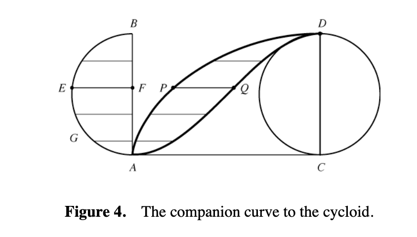

# Area between curves




This section uses these add-on packages:


```{julia}
using CalculusWithJulia
using Plots; plotly()
using Roots
using QuadGK
using SymPy
```


## Area enclosed between two curves


The definite integral gives the "signed" area between the function $f(x)$ and the $x$-axis over $[a,b]$. Conceptually, this is the area between two curves, $f(x)$ and $g(x)=0$. More generally:

::: {.definition title="Area between two curves"}

Suppose $f(x)$ and $g(x)$ are integrable functions on $[a,b]$ and $f(x) \geq g(x)$. Then the area between the curves given by $f(x)$ and $g(x)$ over the interval $[a,b]$ is given by:
$$
\int_a^b \left(f(x) - g(x)\right) dx
$$


In general, this integral yields the "signed" area between the two curves.
:::


Consider @fig-area-between-f-g. The shaded rectangle has area: $(f(c)-g(c)) \cdot (x_{i+1}-x_i)$ for some $x_i \le c \le  x_{i+1}$. This is suggestive of a term in a Riemann sum of the integral of $f(x) - g(x)$.


::: {#fig-area-between-f-g}

```{julia}
#| echo: false
p = let
    gr()
	# area between graphs
	# https://github.com/SigurdAngenent/WisconsinCalculus/blob/master/figures/221/09areabetweengraphs.pdf

	f(x) = 1/6+x^3*(2-x)/2
	g(x) = 1/6+exp(x/3)+(1-x/1.7)^6-0.6
	a,b =0.2, 1.7
	A, B = 0, 2
	A′, B′ = A + .1, B - .1
	n = 20

	plot(; empty_style..., aspect_ratio=:equal, xlims=(A,B))
	plot!(f, A′, B′; fn_style...)
	plot!(g, A′, B′; fn_style...)

	xp = range(a, b, n)
	marked = n ÷ 2
	for i in 1:n-1
		x0, x1 = xp[i], xp[i+1]
	  	mpt  = (x0 + x1)/2
	    R = Shape([x0,x1,x1,x0], [f(mpt),f(mpt),g(mpt),g(mpt)])
	    color = i == marked ? :gray : :white
		plot!(R; fill=(color, 0.5), line=(:black, 1))
	end

	# axis
	plot!([(A,0),(B,0)]; axis_style...)

	# highlight
	x0, x1 = xp[marked], xp[marked+1]
	_style = (;line=(:gray, 1, :dash))
	plot!([(a,0), (a, f(a))]; _style...)
	plot!([(b,0), (b,f(b))]; _style...)
	plot!([(x0,0), (x0, f(x0))]; _style...)
	plot!([(x1,0), (x1, f(x1))]; _style...)

	annotate!([
		(B′, f(B′), text(L"f(x)", 10, :left,:top)),
		(B′, g(B′), text(L"g(x)", 10, :left, :bottom)),
		(a, 0, text(L"a=x_0", 10, :top, :left)),
		(b, 0, text(L"b=x_n", 10, :top, :left)),
		(x0, 0, text(L"x_i", 10, :top)),
		(x1, 0, text(L"x_{i+1}", 10, :top,:left))
	])

	current()
end

plotly()
p
```

Illustration of a Riemann sum approximation to estimate the area between $f(x)$ and $g(x)$ over an interval $[a,b]$.
:::


##### Example

Find the area between $f(x) = \sqrt{x}$ and  $g(x) = x^2$ over $[1/4, 3/4]$. As $f(x) \geq g(x)$ on this interval, we have:


$$
\int_{1/4}^{3/4} (x^{1/2} - x^2) dx = (\frac{x^{3/2}}{3/2} - \frac{x^3}{3})\Big|_{1/4}^{3/4} = \frac{\sqrt{3}}{4} -\frac{7}{32}.
$$


For the same functions, find the area between the functions over $[1/4, 4]$.

The two graphs cross at $x=1$, so this would need to be done with two integrals:

$$
\begin{align*}
A &= \int_{1/4}^{1} (x^{1/2} - x^2) dx + \int_1^4 (x^2 - x^{1/2}) dx\\
&= \left(\frac{x^{3/2}}{3/2} - \frac{x^3}{3}\right) \Big|_{1/4}^1 +
\left(\frac{x^3}{3} - \frac{x^{3/2}}{3/2}\right) \Big|_1^4\\
&= \left(\left[\frac{2}{3} - \frac{1}{3}\right]-
         \left[\frac{1}{12} - \frac{1}{192}\right] +
         \left[\frac{64}{3} - \frac{16}{3}\right] -
         \left[\frac{1}{3} - \frac{2}{3}\right]\right)\\
&= \frac{49}{192}
\end{align*}
$$

##### Example

Find the area between

$$
\begin{align*}
f(x) &= \frac{x^3 \cdot (2-x)}{2} \text{ and } \\
g(x) &= e^{x/3} + (1-\frac{x}{1.7})^6 - 0.6
\end{align*}
$$

over the interval $[0.2, 1.7]$. The area is illustrated in @fig-area-between-f-g.

```{julia}
f(x) = x^3*(2-x)/2
g(x) = exp(x/3) + (1 - (x/1.7))^6 - 0.6
a, b = 0.2, 1.7
h(x) = g(x) - f(x)
answer, _ = quadgk(h, a, b)
answer
```

##### Example

Find the area bounded by the line $y=2x$ and the curve $y=2 - x^2$.

::: {#fig-plot-parabola-and-line-where-intersect}
```{julia}
#| echo: false
let
    f(x) = 2 - x^2
    g(x) = 2x
    plot(; legend=false, xlims=(-3,3))
    plot!(f; line=(1, :black))
    plot!(g; line=(1, :black))
    a, b = find_zeros(x -> f(x) - g(x), (-3, 3))
    plot!(f, a, b; line=(5, :black, 0.25))
    plot!(g, a, b; line=(5, :black, 0.25))
end
```

Plot of $2-x^2$ and $2x$ over $[-3,3]$ to see the two intersection points.
:::


We plot both curves in @fig-plot-parabola-and-line-where-intersect to see the two intersection points, $a$ and $b$, happen in $[-3, 3]$. These are found numerically through:

```{julia}
f(x) = 2 - x^2
g(x) = 2x
h(x) = f(x) - g(x)
a,b = find_zeros(h, -3, 3)
```

The answer then can be found numerically:


```{julia}
first(quadgk(h, a, b))
```

##### Example


Find the integral between $f(x) = \sin(x)$ and $g(x)=\cos(x)$ over $[0,2\pi]$ where $f(x) \geq g(x)$.


@fig-plot-sin-cos-over-0-2pi-find-intersection-points shows the areas:

::: {#fig-plot-sin-cos-over-0-2pi-find-intersection-points}
```{julia}
#| echo: false
let
    f(x) = sin(x)
    g(x) = cos(x)
    plot(f, 0, 2pi; label="sin")
    plot!(g; label="cos")
    a, b= pi/4, 5pi/4
    plot!(f, a, b; label=nothing, line=(5, :black, 0.25))
    plot!(g, a, b; label=nothing, line=(5, :black, 0.25))
end
```

Plot of $\sin(x)$ and $\cos(x)$ over $[0, 2\pi]$
:::

There is a single interval when $f \geq g$ and this can be found algebraically using basic trigonometry, or numerically:


```{julia}
f(x) = sin(x)
g(x) = cos(x)

a, b = find_zeros(x -> f(x) - g(x), 0, 2pi)  # pi/4, 5pi/4
quadgk(x -> f(x) - g(x), a, b)[1]
```

##### Example


Find the area between $x^n$ and $x^{n+1}$ over $[0,1]$ for $n=1,2,\dots$.


On this interval we have $x^n \geq x^{n+1}$, so the integral can be found symbolically through:


```{julia}
@syms x::positive n::positive
ex = integrate(x^n - x^(n+1), (x, 0, 1))
together(ex)
```

Based on this answer, what is the value of this sum:


$$
\frac{1}{2\cdot 3} + \frac{1}{3\cdot 4} + \frac{1}{4\cdot 5} + \cdots
$$

The answer is $1/2$. This is no surprise. In @fig-x-to-n-n-1-to-20) the areas computed carve up the area under the line $y=x^1$ over $[0,1]$

::: {#fig-x-to-n-n-1-to-20}
```{julia}
#| echo: false
plt = plot(x, 0, 1; legend=false, line=(1, :black))
[plot!(plt, x^n; line=(1, :black)) for n in 2:20]
plt
```

Plot of $x^n$ over $[0,1]$ for $n$ in $1$ to $20$.
:::


We can check using the `summation` function of `SymPy` which is similar in usage to `integrate`:


```{julia}
summation(1/((n+1) * (n+2)), (n, 1, oo))
```

##### Example

Verify [Archimedes'](http://en.wikipedia.org/wiki/The_Quadrature_of_the_Parabola) finding that the area of the parabolic segment is $4/3\text{rds}$ that of the triangle joining $a$, $(a+b)/2$ and $b$. @fig-area-between-f-g clearly shows the bigger parabolic segment area.

::: {#fig-archimedes-triangle}
```{julia}
#| hold: true
#| echo: false
f(x) = 2 - x^2
a,b = -1, 1/2
c = (a + b)/2
xs = range(-sqrt(2), stop=sqrt(2), length=50)
rxs = range(a, stop=b, length=50)
rys = map(f, rxs)

plot(f, a, b, legend=false,
     line=(3, :royalblue),
     axis=([], false)
     )
plot!([a,b], [f(a),f(b)], line=(3, :royalblue))
xs = [a,c,b,a]
triangle = Shape(xs, f.(xs))
plot!(triangle, fill=(:forestgreen, 3, 0.25))

```

Area of parabolic segment and triangle
:::

For concreteness, let $f(x) = 2-x^2$ and $[a,b] = [-1, 1/2]$, as in the figure. Then the area of the triangle can be computed through:


```{julia}
f(x) = 2 - x^2
a, b = -1, 1/2
𝐜 = (a + b)/2

sac, sab, scb = secant(f, a, 𝐜), secant(f, a, b), secant(f, 𝐜, b)
f1(x) = min(sac(x), scb(x))
f2(x) = sab(x)

A1 = first(quadgk(x -> f1(x) - f2(x), a, b))
```

As we needed three secant lines, we used the `secant` function from `CalculusWithJulia` to create functions representing each. Once that was done, we used the `min` function to facilitate integrating over the top bounding curve, alternatively, we could break the integral over $[a,c]$ and $[c,b]$, as would be recommended for a symbolic approach.


The area of the parabolic segment is more straightforward.


```{julia}
A2 = first(quadgk(x -> f(x) - f2(x), a, b))
```

Finally, if Archimedes was right, these values should be equal (up to rounding errors)


```{julia}
A1 * 4/3 ≈ A2
```


##### Example


Find the area bounded by $y=x^4$ and $y=e^x$ when $x^4 \geq e^x$ and $x > 0$.


@fig-x-to-4-and-exp-x-over-0-10 graphs the two functions and shows clearly the largest zero, for afterwards the exponential dominates the power.

::: {#fig-x-to-4-and-exp-x-over-0-10}
```{julia}
#| echo: false
let
    h1(x) = x^4
    h2(x) = exp(x)
    plot(; xlims=(0, 10), legend=false)
    plot!(h1; line=(1, :black))
    plot!(h2; line=(1, :black))
    a,b = find_zeros(x -> h1(x) - h2(x), 0, 10)
    plot!(h1, a, b; line=(5, :black, 0.25))
    plot!(h2, a, b; line=(5, :black, 0.25))
end
```

Plot of $x^4$ and $e^x$ over $[0, 10]$
:::

There must be another zero, though it is hard to see from the graph over $[0,10]$, as $0^4=0$ and $e^0=1$, so the polynomial must cross below the exponential to the left of $5$. (Otherwise, plotting over $[0,2]$ will clearly reveal the other zero.) We now find these intersection points numerically and then integrate:


```{julia}
#| hold: true
h1(x) = x^4
h2(x) = exp(x)
a,b = find_zeros(x -> h1(x) - h2(x), 0, 10)
quadgk(x -> h1(x) - h2(x), a, b)[1]
```

##### Examples


The area between $y=\sin(x)$ and $y=m\cdot x$ between $0$ and the first positive intersection depends on $m$ (where $0 \leq m \leq 1$). The extremes are when $m=0$, the area is $2$ and when $m=1$ (the line is tangent at $x=0$), the area is $0$. What is it for other values of $m$? @fig-plot-sinx-and-mx-over-0-pi show the two functions when $m=1/2$.


::: {#fig-plot-sinx-and-mx-over-0-pi}
```{julia}
#| echo: false
let
    m = 1/2
    a, b = 0, find_zero(x -> sin(x) - m*x, 2)
    plot(; xlims=(0, pi), legend=false)
    plot!(sin, 0, pi; line=(1, :black))
    plot!(sin, a, b; line=(5, :black, 0.25))
    plot!(x -> m*x; line=(1, :black))
    plot!(x -> m*x, a, b; line=(5, :black,  0.25))
end
```

Plot of $\sin(x)$ and $m\cdot x$ over $[0, \pi]$ when $m=1/2$
:::

For a given $m$, the area is found after computing $b$, the intersection point. We express this as a function of $m$ for later reuse:


```{julia}
intersection_point(m) = maximum(find_zeros(x -> sin(x) - m*x, 0, pi))
a1 = 0
b1 = intersection_point(1/2)
first(quadgk(x -> sin(x) - x/2, a1, b1))
```

In general, the area then as a function of `m` is found by substituting `intersection_point(m)` for `b`:


```{julia}
area(m) = first(quadgk(x -> sin(x) - m*x, 0, intersection_point(m)))
```

@fig-plot-area-over-0-1-shows-monotonic shows the relationship and that the function is monotonically decreasing, as would be guessed.

::: {#fig-plot-area-over-0-1-shows-monotonic}
```{julia}
#| echo: false
plot(area, 0, 1; label="area")
```

Plot of `area` over $[0,1]$
:::

While here, let's also answer the question of which $m$ gives an area of $1$, or one-half the total? This can be done as follows:


```{julia}
find_zero(m -> area(m) - 1, (0, 1))
```

(Which is a nice combination of using `find_zeros`, `quadgk` and `find_zero` to answer a problem.)


##### Example

In an early 2023 article appearing in the [New York Times](https://www.nytimes.com/2023/02/02/opinion/covid-pandemic-deaths.html) a discussion on *excess* deaths was presented. @fig-excess-deaths shows two curves from which the number of excess deaths can be computed.

::: {#fig-excess-deaths}


Illustration of excess deaths. Figure from a Feb. 2023 New York Times article.
:::


Consider the curve marked *Actual deaths*. The number of deaths per year is the sum over each day of the number of deaths per each day. Approximating this number with a curve and setting 1 day equal to 1 unit, the number of deaths is basically $\int_0^{365} d(t) dt$. This curve is *usually*, say, $u(t)$, so the expected number of deaths would be $\int_0^{365} u(t) dt$. The difference, $\int_0^{365} (d(t) - u(t))dt$ is interpreted as the number of *excess deaths*. This methodology has been used to estimate the true number of deaths attributable to the COVID-19 pandemic.

##### Example

Consider two overlapping circles, one with smaller radius. How much area is in the larger circle that is not in the smaller?^[This question came up on the `Julia` [discourse](https://discourse.julialang.org/t/is-there-package-or-method-to-calculate-certain-area-in-julia-symbolically-with-sympy/99751) discussion board. A solution, modified from an answer of `@rocco_sprmnt21` is followed.]

Without losing too-much generality, we can consider the smaller circle to have radius $a$, the larger circle to have radius $b$ and centered at $(0,c)$.
We assume some overlap: $a \ge c-b$, but not too much: $c-b \ge 0$ or $0 \le c-b \le a$.

```{julia}
@syms x::real y::real a::positive b::positive c::positive
c₁ = x^2 + y^2 - a^2
c₂ = x^2 + (y-c)^2 - b^2
y₀ = first(solve(c₁ ~ c₂ , y))
x₀ = sqrt(a - y₀^2) # point of intersection
```

Plotting with $a=1, b=3/2, c=2$ we have:

::: {#fig-two-overlapping-circles-plotted}
```{julia}
#| echo: false
let 𝑎 = 1, 𝑏=3/2, 𝑐=2

    @assert 0 ≤ 𝑐 - 𝑏 ≤ 𝑎

    y = N(y₀(a => 𝑎, b => 𝑏, c => 𝑐))
    x = sqrt(𝑎^2 - y^2)

    p = plot(; legend=false, aspect_ratio=:equal)

    plot!(x -> 𝑐 + sqrt(𝑏^2 - x^2), -𝑏, 𝑏; color=:black)
    plot!(x -> 𝑐 - sqrt(𝑏^2 - x^2), -𝑏, -x; color=:black)
    plot!(x -> 𝑐 - sqrt(𝑏^2 - x^2),  x,  𝑏; color=:black)

    plot!(x ->  sqrt(𝑎^2 - x^2), -x,  x; color=:black)
    plot!(x ->  sqrt(𝑎^2 - x^2), -𝑎, -x; color=:blue)
    plot!(x ->  sqrt(𝑎^2 - x^2),  x,  𝑎; color=:blue)
    plot!(x -> -sqrt(𝑎^2 - x^2), -𝑎,  𝑎; color=:blue)

    scatter!([-x, x], [y, y])

    plot!([0, 𝑏], [𝑐, 𝑐]; linestyle=:dash)
    annotate!([(0, 𝑐, text(L"(0, c)", 10,  :left)),
               (𝑏, 𝑐, text(L"(b, c)", 10,  :left)),
               (x, y, text(L"(x_0, y_0)", 10, :left))])

    plot!([0, 0], [𝑎, 𝑐 + 𝑏]; color=:green)
    plot!([x, x], [y, 𝑐 + sqrt(𝑏^2 - x^2)]; color=:green)
    p
end
```

Plot of two overlapping circles showing a decomposition that might make finding the area tractable
:::

With this orientation, we can see by symmetry that the area is twice the integral from $[0,x_0]$ and from $[x_0, b]$ **provided** $0 \le c- b \le a$:

```{julia}
a1 = integrate(c + sqrt(b^2 - x^2) - (sqrt(a^2 - x^2)), (x, 0, x₀))
a2 = integrate(c + sqrt(b^2 - x^2) - (c - sqrt(b^2 - x^2)), (x, x₀, b))
A = 2(a1 + a2)
```

And for the $a=1, b=3/2, c=2$:

```{julia}
A(a => 1, b => 3//2, c => 2)
```

As a check, when the two circles just touch, or $a = c-b$, we should get the same as the area of a circle with radius $b$ or $b^2 \cdot \pi$:

```{julia}
A(c=>3, a=>1, b=>2)
```


(This could also be done by computing the amount of overlap the two circles have---with a single integral---and subtracting from the area of the larger circle.)

##### Example


Find the area bounded by the $x$ axis, the line $x-1$ and the function $\log(1 + x)$.


@fig-log1p-and-x-minus-1-over-0-3 shows the basic area.

::: {#fig-log1p-and-x-minus-1-over-0-3}
```{julia}
#| echo: false
let
    j1(x) = log(x+1)
    j2(x) = x - 1
    plot(; legend=false, xlims=(0,3))
    plot!(j1;   line=(1, :black))
    plot!(j2;   line=(1, :black))
    plot!(zero; line=(1, :black))
    c = find_zero(x -> j1(x) - j2(x), 2)
    P,Q,R = (0,0), (1,0), (c, j1(c))
    plot!([P,Q,R]; line=(5, :black, 0.25))
    plot!(j1, 0, c; line=(5, :black, 0.25))
    annotate!([(c, j1(c), text(L"(b, \log(1 + b))", :top,:left))])
end
```

Plot of $\log(1 + x)$, $x-1$, and the $x$ axis over $[0,3]$ used to identify the location of the $x$ value ($b$) of the largest intersection point
:::

The value for "$b$" is found from the intersection point of  $\log(x+1)$ and $x-1$, which is near $2$:


```{julia}
j1(x) = log(1 + x)
j2(x) = x - 1
ja = 0
jb = find_zero(x -> j1(x) - j2(x), 2)
```

We see that the lower part of the area has this condition: if $x < 1$ then use $0$, otherwise use $g(x)$. We can handle this many different ways:


* break the integral into two pieces and add:


```{julia}
first(quadgk(x -> j1(x) - zero(x), ja, 1)) + first(quadgk(x -> j1(x) - j2(x), 1, jb))
```

* make a new function for the bottom bound:


```{julia}
j3(x) = x < 1 ? 0.0 : j2(x)
first(quadgk(x -> j1(x) - j3(x), ja, jb))
```

* Turn the picture on its side and integrate in the $y$ variable. To do this, we need to solve for inverse functions:


```{julia}
#| hold: true
a1=j1(ja)
b1=j1(jb)
f1(y)=y+1                # y=x-1, so x=y+1
g1(y)=exp(y)-1           # y=log(x+1) so e^y = x + 1, x = e^y - 1
quadgk(y -> f1(y) - g1(y), a1, b1)[1]
```

:::{.callout-note}
## Note
When doing problems by hand this latter style can often reduce the complications, but when approaching the task numerically, the first two styles are generally easier, though computationally more expensive.

:::


#### Integrating in different directions


The last example suggested integrating in the $y$ variable. This could have more explanation.


It has been noted that different symmetries can aid in computing integrals through their interpretation as areas. For example, if $f(x)$ is odd, then $\int_{-b}^b f(x)dx=0$ and if $f(x)$ is even, $\int_{-b}^b f(x) dx = 2\int_0^b f(x) dx$.


Another symmetry of the $x-y$ plane is the reflection through the line $y=x$. This has the effect of taking the graph of $f(x)$ to the graph of $f^{-1}(x)$ and vice versa. Here is an example with $f(x) = x^3$ over $[-1,1]$.

::: {#fig-plot-inverse-function-of-x-cubed}
```{julia}
f(x) = x^3
xs = range(-1, stop=1, length=50)
ys = f.(xs)
plot(ys, xs)
```

Plot of inverse function of $x^3$
:::

By switching the order of the `xs` and `ys` we "flip" the graph through the line $x=y$.


We can use this symmetry to our advantage. Suppose instead of being given an equation $y=f(x)$, we are given it in "inverse" style: $x = f(y)$, for example suppose we have $x = y^3$. We can plot this as above via:

::: {#fig-plot-function-in-inverse-style-y-cubed}
```{julia}
#| hold: true
ys = range(-1, stop=1, length=50)
xs = [y^3 for y in ys]
plot(xs, ys)
```
Plot of function given in inverse style
:::

Suppose we wanted the area in the first quadrant between this graph, the $y$ axis and the line $y=1$. What to do? With the problem "flipped" through the $y=x$ line, this would just be $\int_0^1 x^3dx$. Rather than mentally flipping the picture to integrate, instead we can just integrate in the $y$ variable. That is, the area is  $\int_0^1 y^3 dy$. The mental picture for Riemann sums would be have the approximating rectangles laying flat and as a function of $y$, are given a length of $y^3$ and height of "$dy$" (cf. @fig-integrate-in-x-or-in-y-it-is-all-just-area).

::: {#fig-integrate-in-x-or-in-y-it-is-all-just-area}
```{julia}
#| hold: true
#| echo: false
f(x) = x^(1/3)
f⁻¹(x) = x^3
plot(f, 0, 1; label="f", linewidth=5, color=:blue, aspect_ratio=:equal)
plot!([0,1,1],[0,0,1], linewidth=1, linestyle=:dash, label="")
x₀ = 2/3
Δ = 1/16
col = RGBA(0,0,1,0.25)
function box(x,y,Δₓ, Δ, color=col)
	plot!([x,x+Δₓ, x+Δₓ, x, x], [y,y,y+Δ,y+Δ,y], color=:black, label="")
	plot!(x:Δₓ:(x+Δₓ), u->y, fillto = u->y+Δ, color=col, label="")
end
box(x₀, 0, Δ, f(x₀), col)
box(x₀+Δ, 0, Δ, f(x₀+Δ), col)
box(x₀+2Δ, 0, Δ, f(x₀+2Δ), col)
colᵣ = RGBA(1,0,0,0.25)
box(f⁻¹(x₀-0Δ), x₀-1Δ, 1 - f⁻¹(x₀-0Δ), Δ, colᵣ)
box(f⁻¹(x₀-1Δ), x₀-2Δ, 1 - f⁻¹(x₀-1Δ), Δ, colᵣ)
box(f⁻¹(x₀-2Δ), x₀-3Δ, 1 - f⁻¹(x₀-2Δ), Δ, colᵣ)
```

The figure  suggests that the area under $f(x)$ over $[a,b]$ could be represented as the area between the curves $f^{-1}(y)$ and $x=b$ from $[f(a), f(b)]$
:::


---


For a less trivial problem, consider the area between $x = y^2$ and $x = 2-y$ in the first quadrant shown in @fig-plot-x-y-squared-x-2-minus-y.

::: {#fig-plot-x-y-squared-x-2-minus-y}
```{julia}
#| echo: false
let
    ys = range(0, stop=2, length=50)
    xs = [y^2 for y in ys]
    plot(xs, ys; label=L"x = y^2")
    xs = [2-y for y in ys]
    plot!(xs, ys; label=L"x = 2-y")
    plot!(zero; label=nothing)

    P,Q,R = (0,0), (2,0), (1, 1)
    plot!([P,Q,R]; label=nothing, line=(5, :black, 0.25))
    plot!(sqrt, 0, 1; label=nothing, line=(5, :black, 0.25))
end
```

Plot of $x=y^2$ and $x = 2-y$
:::

In the figure, the bounded area could be described in the "$x$" variable in terms of two integrals, but in the $y$ variable in terms of the difference of two functions with the limits of integration running from $y=0$ to $y=1$. So, this area may be found as follows:


```{julia}
#| hold: true
f(y) = 2-y
g(y) = y^2
a, b = 0, 1
quadgk(y -> f(y) - g(y), a, b)[1]
```

## The area enclosed in a simple polygon

We now turn our attention to a variation of the area bounded between two curves.
A simple polygon is comprised of several *non-intersecting* line segments, save for the last segment ends where the first begins. These have an orientation, which we take to be counterclockwise. Polygons, as was seen when computing areas related to Archimedes efforts, can be partitioned into simple geometric shapes, for which known areas apply. In this section we discuss partitions that allow the enclosed area to be computed.


### The triangle formula

First, let's work out a formula for the area of a triangle formed by three points: $O=(0,0)$, $P=(x_1, y_1)$, and $Q = (x_2, y_2)$ where we assume the angles for $P$ and $Q$ are as in @fig-area-of-triangle-3-points (the angle $0 < \theta < \pi$).

::: {#fig-area-of-triangle-3-points}
```{julia}
#| echo: false
let
    gr()
    function plot_arc!(plt, r, θ₁, θ₂, txt, i=50)
        ts = range(θ₁, θ₂, 100)
        xs, ys = r * cos.(ts), r * sin.(ts)
        plot!(plt, xs, ys; line=(1, :dot, :black), arrow=:right)
        annotate!(plt, (xs[i], ys[i], text(txt, :left, :bottom)))
    end

    O = (0, 0)
    x1, y1 = P = (2, 2)
    x2, y2 = Q = (1, 3)
    plt = plot(; legend=false, aspect_ratio=:equal, framestyle=:orgin)
    plot!(plt, [O,P,Q,O]; line=(1, :black))
    scatter!(plt, [O, P, Q]; marker=(5, :black))
    annotate!(plt, [
        (O..., text(L"O", :right, :bottom)),
        (P..., text(L"P", :left, :top)),
        (Q..., text(L"Q", :right, :bottom))])
    θ₁, θ₂ = atan(y1, x1), atan(y2, x2)
    plot_arc!(plt, 0.4, 0, θ₁, L"\theta_1", 1)
    plot_arc!(plt, 0.6, 0, θ₂, L"\theta_2", 80)
    plot_arc!(plt, 0.9, θ₁, θ₂, L"\theta", 50)
    plotly()
    plt
end
```

Triangle $\triangle OPQ$ with $\theta_2 > \theta_1$
:::

The area of a triangle is $1/2 \cdot  b \cdot h$. The base of the triangle in @fig-area-of-triangle-3-points is the length of $OP$, the height is the length of $OQ$ times $\sin(\theta)$. We can then compute in terms of coordinates:

$$
\begin{align*}
A &= \frac{1}{2} b \cdot h\\
&= \frac{1}{2} \lvert \overline{PQ} \rvert \cdot \lvert\overline{OQ}\rvert \sin(\theta) \\
&= \frac{1}{2} \lvert \overline{PQ} \rvert \cdot \lvert\overline{OQ}\rvert \sin(\theta_2 - \theta_1) \\
&= \frac{1}{2} \lvert \overline{PQ} \rvert \cdot \lvert\overline{OQ}\rvert \left(\sin(\theta_2)\cos(\theta_1) - \cos(\theta_2)\sin(\theta_1)\right) \\
&= \frac{1}{2} \lvert\overline{PQ}\rvert \cdot \lvert\overline{OQ}\rvert
\left(\frac{y_2}{\lvert\overline{OQ}\rvert}\frac{x_1}{\lvert\overline{PQ}\rvert} - \frac{x_2}{\lvert\overline{OQ}\rvert}\frac{y_1}{\lvert\overline{PQ}\rvert}\right)\\
&= \frac{1}{2} \left(x_1 y_2 - y_1 x_2 \right).
\end{align*}
$$

The expression $x_1 y_2 - y_1 x_2$ is sometimes written using *determinant* notation

$$
x_1 y_2 - y_1 x_2 =
\left|
\begin{align*}
x_1 &\quad x_2\\
y_1 &\quad y_2\\
\end{align*}
\right|.
$$

Now consider a *simple*, convex polygon with $(0,0)$ in its interior. We can create triangles to partition the polygon as in @fig-simple-case-for-triangle-formula-to-compute-area-simple-polygon.

::: {#fig-simple-case-for-triangle-formula-to-compute-area-simple-polygon}
```{julia}
#| echo: false
let
    xs = [-1,  1,  2,    0, -1]
    ys = [-1, -1,  1/2,  1, -1]

    gr()
    S = Shape(xs, ys)
    plt = plot(; legend=false, aspect_ratio=:equal, framestyle=:origin)
    plot!(plt, xs, ys)
    scatter!(plt, xs,  ys; marker=(7, :circle))
    for i in 1:4
    col = xs[i]*ys[i+1] - xs[i+1]*ys[i] > 0 ? :yellow : :blue
        S = Shape([(0,0), (xs[i],ys[i]), (xs[i+1],ys[i+1])])
        plot!(plt, S, fill=(col, 0.25))
    end
    plotly()
    plt
end
```

Partition of simple example using triangles to compute the area inside a simple polygon
:::

The triangles do not overlap, so the area inside the polygon is the sum of the areas of each triangle. This is found from:

$$
\frac{1}{2} \cdot \left(
(x_1 y_2 - y_1 x_2) + (x_2 y_3 - y_2 x_3) + (x_3 y_4 - y_3 x_4) + (x_4 y_1 - y_4 x_1)
\right)
$$


For the points in @fig-simple-case-for-triangle-formula-to-compute-area-simple-polygon this value is:

```{julia}
xs = [-1,  1,  2,    0, -1]
ys = [-1, -1,  1/2,  1, -1]

(1/2) * sum(xs[i]*ys[i+1] - xs[i+1]*ys[i] for i in 1:4)
```

More generally, we have:

::: {.definition title="Area of a simple polygon described by Cartesian coordinates"}
The area enclosed in a simple polygon with $n$ points (labeled by $P_i = (x_i, y_i)$) traversed in a counter-clockwise manner is given by:

$$
A = \sum_{i=1}^{n-1} \left(x_i y_{i+1} - y_i x_{i+1}\right) + \left( x_n y_1 - y_n x_1\right).
$$
:::

This formula is motivated above by a convex polygon with the origin in its interior, but extends to any simple polygon.
This formula is often called Gauss's shoelace formula, so called as diagrams like @fig-gauss-shoelace-formula, which are used to help remember what gets multiplied and what terms are subtracted, resemble the laces of  shoes.

::: {#fig-gauss-shoelace-formula}
```{julia}
#| echo: false
let
    gr()
	function plot_circles!(plt, i, l1, l2, col=:blue)
	    S = Plots.scale(Shape(:circle), 0.3)
		for j in 0:1
	        S′ = Plots.translate(S, i, j)
	        plot!(plt, S′, fill=(0, 0.0), line=(2, col))
			annotate!([(i,1,text(l1)), (i,0, text(l2))])
		end
    end
	function criss_cross!(plt, i)
		ts = range(0,1, 100)[25:75]
		plot!(plt, i .+ ts, 1 .- ts; line=(3, :blue), arrow=true)
		plot!(plt, i .+ ts,  ts; line=(3, :red), arrow=true)
	end
	plt = plot(; legend=false, aspect_ratio=:equal, xaxis=([], false),
               yaxis=([], false))
	plot_circles!(plt, 0, L"x_1", L"y_1")
	plot_circles!(plt, 1, L"x_2", L"y_2")
	plot_circles!(plt, 2, L"x_3", L"y_3")
	plot_circles!(plt, 3, L"x_4", L"y_4")
	plot_circles!(plt, 4, L"x_1", L"y_1", :green)
	for i in 0:3
		criss_cross!(plt, i)
	end
    plotly()
	plt
end
```

Representation to remember Gauss's shoelace formula for computing the area of a simple polygon
:::

The above formula computes the area for simple polygon described by Cartesian coordinates and traversed in a counter-clockwise manner. Traversing in a clockwise manner will produce the same number multiplied by $-1$. This formula extends to compute the area of any simple polygon traversed in a counter-clockwise manner. For non-simple polygons, the formula can be applied with care to account for "negative" area when the traversal is in the clockwise manner.

### The trapezoid formula

In this example, we see how trapezoids can be used to find the interior area encolosed by a simple polygon, avoiding integration.

Consider a trapezoid formed by points $P_1 = (x_1, y_1)$, $P_2 = (x_2, y_2)$, $P_3 = (x_2, 0)$, and $P_4 = (x_1, 0)$. Assume $x_1 > x_2$. The area is the average of the heights times the length of the base:

$$
A = \frac{1}{2}\left(y_2 + y_1\right) \cdot (x_1 - x_2) =
- \frac{1}{2}\left(y_2 + y_1\right) \cdot (x_2 - x_1).
$$

::: {.definition title="Area inside a simple polygon"}

Consider a simple polygon described by points $(x_1,y_1), (x_2,y_2), \dots, (x_n, y_n)$ Set $(x_{n+1}, y_{n+1}) = (x_1,y_1)$. Assume the points traverse the simple polygon in a counter-clockwise manner. Then the area contained within the polygon is given by the formula:

$$
A = \sum_{i=1}^n \frac{1}{2} \left(y_{i+1} + y_i\right) \cdot \left(x_{i+1} - x_i \right).
$$

Each term describes the *signed* area of a trapezoid, with a sign of $1$ if $x_{i+1} \le x_i$ and $-1$ otherwise.
:::

We illustrate the formula with a simple polygon shown in @fig-simple-case-for-trapezoid-formula-to-compute-area-simple-polygon. (The same shape as before, but shifted up and over by $2$ units.)

::: {#fig-simple-case-for-trapezoid-formula-to-compute-area-simple-polygon}
```{julia}
xs = [1, 3, 4,   2, 1] # n = 4 to give 5=n+1 values
ys = [1, 1, 5/2, 3, 1]
plt = plot(; line=(3, :black), framestyle=:origin, aspect_ratio=:equal, legend=false)

plot!(plt, xs, ys)
scatter!(plt, xs,  ys; marker=(5, :black))
```

A simple polygon whose area can be computed by the trapezoid formula
:::


Going further, we draw the four trapezoids associated to @fig-simple-case-for-trapezoid-formula-to-compute-area-simple-polygon using different colors (blue or yellow) depending on the sign of the `xs[i+1] - xs[i]` terms in @fig-simple-case-for-trapezoid-formula-to-compute-area-simple-polygon-with-colors.

::: {#fig-simple-case-for-trapezoid-formula-to-compute-area-simple-polygon-with-colors}
```{julia}
#| echo: false
for i in 1:4
    col = xs[i+1] - xs[i] > 0 ? :yellow : :blue
    S = Shape([(xs[i],0), (xs[i+1],0), (xs[i+1],ys[i+1]), (xs[i], ys[i])])
    plot!(plt, S, fill=(col, 0.25))
end
P1, P2, P3, P4, _ = zip(xs, ys)
annotate!(plt, [(P1..., text(L"P_1", :right, :top)),
                (P2..., text(L"P_2", :left, :top)),
                (P3..., text(L"P_3", :left, :bottom)),
                (P4..., text(L"P_4", :right, :bottom))])
plt
```
Simple polygon of @fig-simple-case-for-trapezoid-formula-to-compute-area-simple-polygon with trapezoids used to compute area filled in
:::

The yellow trapezoids appear to be colored grey, as they completely overlap with parts of the blue trapezoids and blue and yellow display as grey. As the signs of the differences of the $x$ values are different, these areas add to $0$ in the sum, leaving just the area of the interior when the sum is computed.

For this particular figure, the enclosed area is

```{julia}
- sum((ys[i+1] + ys[i]) / 2 * (xs[i+1] - xs[i]) for i in 1:length(xs)-1)
```

### Area between a parameterized curve

Now suppose a closed, simple curve is parameterized in the counterclockwise direction by $(f(t), g(t))$ for $t$ in $[a,b]$. The area contained in the curve is *approximated* by the area contained in the polygon given by the points $(f(t_i), g(t_i))$ where $a = t_0 < t_1 < \cdots < t_n = b$ is some partition. The approximate area is given by:

$$
\begin{align*}
A &= - \sum_{i=1}^n \frac{y_{i+1} + y_i}{2} \cdot (x_{i+1} - x_i)\\
&= -\frac{1}{2} \sum_{i=1}^n \left(g(t_{i+1}) + g(t_i)\right)\cdot\left(f(t_{i+1}) - f(t_i)\right)\\
&= -\frac{1}{2} \sum_{i=1}^n \left(g(t_{i+1}) + g(t_i)\right)\frac{f(t_{i+1}) - f(t_i)}{t_{i+1} - t_i}\left(t_{i+1} - t_i\right)\\
&\approx -\frac{1}{2} \int_a^b 2g(t) f'(t) dt\\
&= -\int_a^b g(t) f'(t) dt \\
&= \int_a^b f(t) g'(t) dt.
\end{align*}
$$

The last line follows by integration by parts.

::: {.definition title="Area of bounded by a parameterized curve"}
Let $(f(t), g(t))$, $a \le t \leg b$ parameterize a closed, simple curve. Then the area bounded by the curve is given by:

$$
A = \sigma \cdot \int_a^b f(t) g'(t) dt,
$$

where $\sigma =  1$ if the parameterization is in the counter-clockwise direction, and $\sigma = -1$ if the parameterization is in the clockwise direction.
:::

##### Example

The area of a circle is well known, $\pi r^2$. Here we compute it with the above formula using the following parameterization of the perimeter:

```{julia}
@syms t, R
u = R * cos(t)
v = R * sin(t)
integrate(u * diff(v,t), (t, 0, 2PI))
```

##### Example

[Talbot's curve](https://mathshistory.st-andrews.ac.uk/Curves/Talbots/) is parametrically described by

$$
\begin{align*}
u(t) &= \frac{1}{a} \cdot (a^2 + c^2 \cdot \sin(t)^2) \cdot \cos(t)\\
v(t) &= \frac{1}{b} \cdot (a^2 - 2c^2 + c^2 \cdot \sin(t)^2)\cdot \sin(t)
\end{align*}
$$

Find the area bounded by the curve when $a=2$, $b=1$, and $c=3$.

@fig-talbots-curve-a-2-b-1-c-3 shows the curve with the given set of constants.

::: {#fig-talbots-curve-a-2-b-1-c-3}
```{julia}
#| echo: false
let
    @syms a b c t
    u = (a^2 + c^2*sin(t)^2)*cos(t)/a
    v = (a^2 - 2c^2 + c^2*sin(t)^2)*sin(t)/b
    d = (a=>2, b=>1, c=>3)
    plot(u(d...), v(d...), 0, 2pi; legend=false, line=(1, :black))
end
```
Talbot's curve with $a=2$, $b=1$, and $c=3$
:::


We can integrate in terms of the parameters. *However*, this parameterization is in the clockwise direction, so we reverse our limits of integration below:

```{julia}
@syms a b c t
u = (a^2 + c^2*sin(t)^2)*cos(t)/a
v = (a^2 - 2c^2 + c^2*sin(t)^2)*sin(t)/b
A = integrate(u * diff(v, t), (t, 2PI, 0)) # reverse limits to adjust for parameterization
```

Finally, we substitute in the specific parameter values:

```{julia}
A(a=>2, b=>1, c=>3)
```


## Questions


###### Question


Find the area enclosed by the curves $y=2-x^2$ and $y=x^2 - 3$.


```{julia}
#| hold: true
#| echo: false
f(x) = 2 - x^2
g(x) = x^2 - 3
a,b = find_zeros(x -> f(x) - g(x), -10, 10)
val, _ = quadgk(x -> f(x) - g(x), a, b)
numericq(val)
```

###### Question


Find the area between $f(x) = \cos(x)$, $g(x) = x$ and the $y$ axis.


```{julia}
#| hold: true
#| echo: false
f(x) = cos(x)
g(x) = x
a = 0
b = find_zero(x -> f(x) - g(x), 1)
val, _ = quadgk(x -> f(x) - g(x), a, b)
numericq(val)
```

###### Question


Find the area between the line $y=1/2(x+1)$ and half circle $y=\sqrt{1 - x^2}$.


```{julia}
#| hold: true
#| echo: false
f(x) = sqrt(1 - x^2)
g(x) = 1/2 * (x + 1)
a,b = find_zeros(x -> f(x) - g(x), -1, 1)
val, _ = quadgk(x -> f(x) - g(x), a, b)
numericq(val)
```

###### Question


Find the area in the first quadrant between the lines $y=x$, $y=1$, and the curve $y=x^2 / 4$.


```{julia}
#| hold: true
#| echo: false
f(x) = x
g(x) = 1.0
h(x) = min(f(x), g(x))
j(x) = x^2 / 4
a,b = find_zeros(x -> h(x) - j(x), 0, 3)
val, _ = quadgk(x -> h(x) - j(x), a, b)
numericq(val)
```

###### Question


Find the area between $y=x^2$ and $y=-x^4$ for $\lvert x \rvert \leq 1$.


```{julia}
#| hold: true
#| echo: false
f(x) = x^2
g(x) = -x^4
a,b = -1, 1
val, _ = quadgk(x -> f(x) - g(x), a, b)
numericq(val)
```

###### Question


Let `f(x) = 1/(sqrt(pi)*gamma(1/2)) * (1 + x^2)^(-1)` and `g(x) = 1/sqrt(2*pi) * exp(-x^2/2)`. These graphs intersect in two points. Find the area bounded by them.


```{julia}
#| hold: true
#| echo: false
import SpecialFunctions: gamma
f(x) = 1/(sqrt(pi)*gamma(1/2)) * (1 + x^2)^(-1)
g(x) = 1/sqrt(2*pi) * exp(-x^2/2)
a,b =  find_zeros(x -> g(x) - f(x), -3, 3)
val, _ = quadgk(x -> g(x) - f(x), a, b)
numericq(val)
```

(Where `gamma(1/2)` is a call to the [gamma](http://en.wikipedia.org/wiki/Gamma_function) function.)


###### Question


Find the area in the first quadrant bounded by the graph of $x = (y-1)^2$, $x=3-y$ and $x=2\sqrt{y}$. (Hint: integrate in the $y$ variable.)


```{julia}
#| hold: true
#| echo: false
f(y) = (y-1)^2
g(y) = 3 - y
h(y) = 2sqrt(y)
f1(y) = max(f(y), zero(y))
g1(y) = min(g(y), h(y))
a, b = find_zeros(y -> g1(y) - f1(y), [0,2])
val, _ = quadgk(y -> g1(y) - f1(y), a, b)
numericq(val)
```

###### Question


Find the total area bounded by the lines $x=0$, $x=2$ and the curves $y=x^2$ and $y=x$. This would be $\int_a^b \lvert f(x) - g(x) \rvert dx$.


```{julia}
#| hold: true
#| echo: false
f(x) = x^2
g(x) = x
a, b = 0, 2
val, _ = quadgk(x -> abs(f(x) - g(x)), a, b)
numericq(val)
```

###### Question


Look at the sculpture [Le Tamanoir](https://www.google.com/search?q=Le+Tamanoir+by+Calder.&num=50&tbm=isch&tbo=u&source=univ&sa=X&ved=0ahUKEwiy8eO2tqzVAhVMPz4KHXmgBpgQsAQILQ&biw=1556&bih=878) by Calder. A large scale work. How much does it weigh? Approximately?


Let's try to answer that with an educated guess. The right most figure looks to be about 1/5th the total amount. So if we estimate that piece and multiply by 5 we get a good guess. That part looks like an area of metal bounded by two quadratic polynomials. If we compute that area in square inches, then multiply by an assumed thickness of one inch, we have the cubic volume. The density of galvanized steel is 7850 kg/$m^3$ which we convert into pounds/in$^3$ via:


```{julia}
7850 * 2.2 * (1/39.3)^3
```

The two parabolas, after rotating, might look like the following (with $x$ in inches):


$$
f(x) = x^2/70, \quad g(x) = 35 + x^2/140
$$

Put this altogether to give an estimated weight in pounds.


```{julia}
#| hold: true
#| echo: false
f(x) = x^2/70
g(x) = 35 + x^2/140
a,b = find_zeros(x -> f(x) - g(x), -100, 100)
ar, _ = quadgk(x -> abs(f(x) - g(x)), a, b)
val = 5 * ar * 7850 * 2.2 * (1/39.3)^3
numericq(val)
```

Is the guess that the entire sculpture is more than two tons?


```{julia}
#| hold: true
#| echo: false
choices=["Less than two tons", "More than two tons"]
answer = 2
radioq(choices, answer, keep_order=true)
```

:::{.callout-note}
## Note
We used area to estimate weight in this example, but Galileo used weight to estimate area. It is [mentioned](https://www.maa.org/sites/default/files/pdf/cmj_ftp/CMJ/January%202010/3%20Articles/3%20Martin/08-170.pdf) by Martin that in order to estimate the area enclosed by one arch of a cycloid, Galileo cut the arch from some material and compared the weight to the weight of the generating circle. He concluded the area is close to $3$ times that of the circle, a conjecture proved by Roberval in 1634.

:::

###### Question


Formulas from the business world say that revenue is the integral of *marginal revenue* or the additional money from  selling 1 more unit. (This is basically the derivative of profit). Cost is the integral of *marginal cost*, or the cost to produce 1 more. Suppose we have


$$
\text{mr}(x) = 2 + \frac{e^{-x/10}}{1 + e^{-x/10}}, \quad
\text{mc}(x) = 1 + \frac{1}{2} \cdot \frac{e^{-x/5}}{1 + e^{-x/5}}.
$$

Find the profit to produce 100 units: $P = \int_0^{100} (\text{mr}(x) - \text{mc}(x)) dx$.


```{julia}
#| hold: true
#| echo: false
mr(x) = 2 + exp((-x/10)) / (1 + exp(-x/10))
mc(x) = 1 + (1/2) * exp(-x/5) / (1 + exp(-x/5))
a, b = 0, 100
val, _ = quadgk(x -> mr(x) - mc(x), 0, 100)
numericq(val)
```

###### Question


Can `SymPy` do what Archimedes did?


Consider the following code which sets up the area of an inscribed triangle, `A1`, and the area of a parabolic segment, `A2` for a general parabola:


```{julia}
#| hold: true
@syms x::real A::real B::real C::real a::real b::real
c = (a + b) / 2
f(x) = A*x^2 + B*x + C
Sec(f, a, b) = f(a) + (f(b)-f(a))/(b-a) * (x - a)
A1 = integrate(Sec(f, a, c) - Sec(f,a,b), (x,a,c)) + integrate(Sec(f,c,b) - Sec(f,a,b), (x, c, b))
A2 = integrate(f(x) - Sec(f,a,b), (x, a, b))
out = 4//3 * A1 - A2
```

Does `SymPy` get the correct output, $0$, after calling `simplify`?


```{julia}
#| hold: true
#| echo: false
yesnoq(true)
```

###### Question


In [Martin](https://www.maa.org/sites/default/files/pdf/cmj_ftp/CMJ/January%202010/3%20Articles/3%20Martin/08-170.pdf) a fascinating history of the cycloid can be read.


```{julia}
#| hold: true
#| echo: false
imgfile="figures/cycloid-companion-curve.png"
caption = """
Figure from Martin  showing the companion curve to the cycloid. As the generating circle rolls, from ``A`` to ``C``, the original point of contact, ``D``, traces out an arch of the cycloid. The companion curve is that found by congruent line segments. In the figure, when ``D`` was at point ``P`` the line segment ``PQ`` is congruent to ``EF`` (on the original position of the generating circle).
"""
# ImageFile(:integrals, imgfile, caption)
nothing
```
::: {#fig-marting-figure-for-cycloid}


Figure from Martin  showing the companion curve to the cycloid. As the generating circle rolls, from ``A`` to ``C``, the original point of contact, ``D``, traces out an arch of the cycloid. The companion curve is that found by congruent line segments. In the figure, when ``D`` was at point ``P`` the line segment ``PQ`` is congruent to ``EF`` (on the original position of the generating circle).
:::


In particular, it can be read that Roberval proved that the area between the cycloid and its companion curve is half the area of the generating circle. Roberval didn't know integration, so finding the area between two curves required other tricks. One is called "Cavalieri's principle." From the figure above, which of the following would you guess this principle to be:


```{julia}
#| hold: true
#| echo: false
choices = ["""
If two regions bounded by parallel lines are such that any parallel between them cuts each region in segments of equal length, then the regions have equal area.
""",
           """
The area of the cycloid is nearly the area of a semi-ellipse with known values, so one can approximate the area of the cycloid with formula for the area of an ellipse
"""]
radioq(choices, 1)
```

Suppose the generating circle has radius $1$, so the area shown is $\pi/2$. The companion curve is then  $1-\cos(\theta)$ (a fact not used by Roberval). The area *under* this curve is then


```{julia}
#| hold: true
@syms theta
integrate(1 - cos(theta), (theta, 0, SymPy.PI))
```

That means the area under **one-half** arch of the cycloid is


```{julia}
#| hold: true
#| echo: false
choices = ["``\\pi``",
           "``(3/2)\\cdot \\pi``",
           "``2\\pi``"
           ]
radioq(choices, 2, keep_order=true)
```

Doubling the answer above gives a value that Galileo had struggled with for many years.


```{julia}
#| hold: true
#| echo: false
imgfile="figures/companion-curve-bisects-rectangle.png"
caption = """
Roberval, avoiding a trigonometric integral, instead used symmetry to show that the area under the companion curve was half the area of the rectangle, which in this figure is `2pi`.
"""
# ImageFile(:integrals, imgfile, caption)
nothing
```


###### Question

```{julia}
#| echo: false
#| label: fig-cavalieri-example
#| fig-cap: "Cavalieri example"
let
squareplus(x, b=2) = x/2 + sqrt(x^2 + b)/2
TeLU(x) = x * tanh(exp(x))
Δ(x) = squareplus(x) - TeLU(x)

a,b = -3, 3
xs = range(a, b, 10)

c = 3
Shift(f,c) = x -> c + f(x)
p = plot(Shift(squareplus, c), a, b;
         legend=false,
         line=(3, :royalblue),
         axis=([], false))
plot!(Shift(TeLU, c),
      line=(3, :royalblue)
      )


plot!(Δ, line=(3, :forestgreen))
plot!(zero, line=(3, :forestgreen))

n = 20
xs = range(a, b, n+1)
for i in 1:n
    S = Shape([xs[i],xs[i]],
              [0, Δ(xs[i])])
    plot!(Plots.translate(S, 0, TeLU(xs[i]) + c), fill=(:royalblue, 0.25))
    plot!(S, fill=(:forestgreen, 0.25))
end
    p
end
```

@fig-cavalieri-example shows on same scale the graphs of $f(x)$ and $g(x)$ and the graphs of $f(x) - g(x)$ and $0$ (the lower figure). Twenty lines were drawn with height $f(x) - g(x)$ on the lower figure and these were translated to the upper figure by an amount $g(x)$. All to illustrate that any parallel line in the $y$ direction intersects the two figures with the same length.

What does this imply:

```{julia}
#| hold: true
#| echo: false
choices = ["The two enclosed areas should be equal",
           "The two enclosed areas are clearly different, as they do not overap"]
radioq(choices, 1)
```

##### Question

Consider the polygon defined by the points $P_1 = (0,0), P_2 = (1, 1/2), P_3 = (2,2)$, and $P_4=(1,3)$. What is the enclosed area?

```{julia}
#| echo: false
xs = [0, 1,   2, 1]
ys = [0, 1.2, 2, 3]
push!(xs, first(xs)); push!(ys, first(ys))

answer = (1/2) * sum(xs[i]*ys[i+1] - xs[i+1]*ys[i] for i in 1:4)
numericq(answer)
```

##### Question

Consider the Polygon defined by the points $P_1 =(0,0), P_2 = (2, 0), P_3 = (0,1), P_4=(2,2)$, and $P_5=(0,2)$. What is the enclosed area?


```{julia}
#| echo: false
xs = [0, 2, 0, 2, 0]
ys = [0,0,1,2,2]
push!(xs, first(xs)); push!(ys, first(ys))

answer = (1/2) * sum(xs[i]*ys[i+1] - xs[i+1]*ys[i] for i in 1:4)
numericq(answer)
```

Now move $P_3$ to $(4,1)$. Will the enclosed area by $4$ units more?

```{julia}
#| echo: false
xs = [0, 2, 0, 2, 0]
ys = [0,0,1,2,2]
push!(xs, first(xs)); push!(ys, first(ys))
a1 = (1/2) * sum(xs[i]*ys[i+1] - xs[i+1]*ys[i] for i in 1:4)
xs[3] = 4
a2 = (1/2) * sum(xs[i]*ys[i+1] - xs[i+1]*ys[i] for i in 1:4)
val = a2 - a1 ≈ 4
radioq(["No", "Yes"], 1 + val)
```

##### Question

A [folium](https://mathshistory.st-andrews.ac.uk/Curves/Folium/) can be parameterized by
$(f(t), g(t)) = (r(t)\cdot \cos(t), r(t) \cdot \sin(t)), where $r(t) = -\cos(t) + 4 \cdot \cos(t) \cdot \sin^2(t)$.

Compute the area between $a=$`0.5236$ and $b=\pi/2$ (cf. @fig-folium-with-some-parameters).

```{julia}
#| echo: false
a, b = 0.5236, pi/2
r(t) = -cos(t) + 4 * cos(t) * sin(t)^2
f(t) = r(t) * cos(t)
g(t) = r(t) * sin(t)
val, _ = quadgk(f ∘ g', a, b)
numericq(val)
```

::: {#fig-folium-with-some-parameters}
```{julia}
#| echo: false
let
    gr()
    r(t) = -cos(t) + 4 * cos(t) * sin(t)^2
    f(t) = r(t) * cos(t)
    g(t) = r(t) * sin(t)

    plt = plot(; legend=false)
    plot!(plt, f, g, 0, 2pi; line=(1, :black))
    a, b = 0.5236, pi/2
    plot!(plt, f, g, a, b; line=(5, :blue))
    plotly()
    plt
end
```
Plot of a folium---a parameterized curve---over $[0, 2\pi]$ with interval $[$`0.5236`$,\pi/2]$ emphasized
:::
