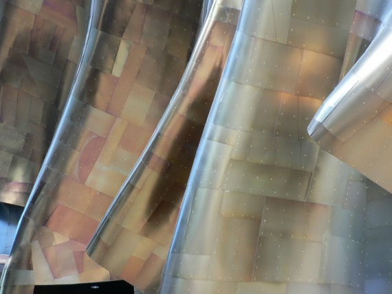

# Surface area




This section uses these add-on packages:


```{julia}
using CalculusWithJulia
using Plots; plotly()
using SymPy
using QuadGK
```


---


## Surfaces of revolution

::: {#fig-gehry-hendrix-museum}



The exterior of the Jimi Hendrix Museum in Seattle has the signature
style of its architect Frank Gehry. The surface is comprised of
patches. A general method to find the amount of material to cover the
surface---the surface area---might be to add up the area of *each* of the
patches. However, in this section we will see for surfaces of
revolution, there is an easier way. (Photo credit to
[firepanjewellery](http://firepanjewellery.com/).)
:::

In this section we see how to find the surface area of volumes generated by revolution.

::: {.definition title="Surface area of a rotated curve"}

The surface area generated by rotating the graph of $f(x)$ between $a$ and $b$  about the $x$-axis is given by the integral

$$
\int_a^b 2\pi f(x) \cdot \sqrt{1 + f'(x)^2} dx.
$$

If the curve is parameterized by $(g(t), f(t))$ between $a$ and $b$ then the surface area is

$$
\int_a^b 2\pi f(t) \cdot \sqrt{g'(t)^2 + f'(t)^2} dt.
$$

These formulas do not add in the surface area of either of the ends.
:::


::: {#fig-surface-revolution-cone}
```{julia}
#| hold: true
#| echo: false
F₀(u,v) = [u, u*cos(v), u*sin(v)] # a cone
us = range(0, 1, length=25)
vs = range(0, 2pi, length=25)
ws = unzip(F₀.(us, vs')) # make square
surface(ws..., legend=false)
plot!([-0.5,1.5], [0,0],[0,0])
```

Surface of revolution forming a cone
:::

The above figure shows a cone (the line $y=x$) presented as a surface of revolution about the $x$-axis.


To see why this formula is as it is, we look at the parameterized case, the first one being a special instance with $g(t) =t$.


Let a partition of $[a,b]$ be given by $a = t_0 < t_1 < t_2 < \cdots < t_n =b$. This breaks the curve into a collection of line segments. Consider the line segment connecting $(g(t_{i-1}), f(t_{i-1}))$ to $(g(t_i), f(t_i))$. Rotating this around the $x$ axis will generate something approximating a disc, but in reality will be the frustum of a cone. What will be the surface area?

::: {#fig-surface-area}
```{julia}
#| echo: false
let
    gr()
    function projection_plane(v)
        vx, vy, vz = v
        a = [-vy, vx, 0] # v ⋅ a = 0
        b = v × a        # so v ⋅ b = 0
        return (a/norm(a), b/norm(b))
    end
    function project(x, v)
        â, b̂ = projection_plane(v)
        (x ⋅ â, x ⋅ b̂)    # (x ⋅ â) â + (x ⋅ b̂) b̂
    end
    radius(t) = 1 / (1 + exp(t))
    t₀, tₙ = 0, 3
    surf(t, θ) = [t, radius(t)*cos(θ), radius(t)*sin(θ)]

	v = [2, -2, 1]
    function plot_axes()
        empty_style = (xaxis = ([], false),
                       yaxis = ([], false),
                       legend=false)

        plt = plot(; empty_style...)

        axis_values = [[(0,0,0), (3.5,0,0)],               # x axis
                       [(0,0,0), (0, 2.0 * radius(0), 0)], # yaxis
                       [(0,0,0), (0, 0, 1.5 * radius(0))]] # z axis

        for (ps, ax) ∈ zip(axis_values, ("x", "y", "z"))
            p0, p1 = ps
            a, b = project(p0, v), project(p1, v)
        annotate!([(b...,text(ax, :bottom))])
            plot!([a, b]; arrow=true, head=:tip, line=(:gray, 1)) # gr() allows arrows
        end

        plt
    end

	function psurf(v)
        (t,θ) -> begin
            v1, v2 = project(surf(t, θ), v)
            [v1, v2] # or call collect to make a tuple into a vector
        end
    end

    function detJ(F, t, θ)
        ∂θ = ForwardDiff.derivative(θ -> F(t, θ), θ)
        ∂t = ForwardDiff.derivative(t -> F(t, θ), t)
        (ax, ay), (bx, by) = ∂θ, ∂t
        ax * by - ay * bx
    end

	function cap!(t, v; kwargs...)
		θs = range(0, 2pi, 100)
		S = Shape(project.(surf.(t, θs), (v,)))
		plot!(S; kwargs...)
	end
    ## ----

	G = psurf(v)
	fold(F, t, θmin, θmax) = find_zero(θ -> detJ(F, t, θ), (θmin, θmax))

    plt = plot_axes()


    ts = range(t₀, tₙ, 100)
    back_edge = fold.(G, ts, 0, pi)
    front_edge = fold.(G, ts, pi, 2pi)
	db = Dict(t => v for (t,v) in zip(ts, back_edge))
	df = Dict(t => v for (t,v) in zip(ts, front_edge))

    # basic shape
    plt = plot_axes()
    plot!(project.(surf.(ts, back_edge), (v,)); line=(:black, 1))
    plot!(project.(surf.(ts, front_edge), (v,)); line=(:black, 1))

    # add caps
    cap!(t₀, v; fill=(:gray, 0.33))
	cap!(tₙ, v; fill=(:gray, 0.33))


	# add rotated surface segment
	i,j = 33,38
	a = ts[i]
	θs = range(db[ts[i]], df[ts[i]], 100)
	θ′s = reverse(range(db[ts[j]], df[ts[j]], 100))
	function 𝐺(t,θ)
		v1, v2 = G(t, θ)
		(v1, v2)
	end
	S = Shape(vcat(𝐺.(ts[i], θs), 𝐺.(ts[j], θ′s)))
	plot!(S)

	θs = range(df[ts[i]], 2pi + db[ts[i]], 100)
	plot!([𝐺(ts[i], θ) for θ in θs]; line=(:black, 1, :dash))

	θs = range(df[ts[j]], 2pi + db[ts[j]], 100)
	plot!([𝐺(ts[j], θ) for θ in θs]; line=(:black, 1))

	plot!([project((ts[i], 0,0),v), 𝐺(ts[i],db[ts[i]])]; line=(:black, 1, :dot), arrow=true)
	plot!([project((ts[j], 0,0),v), 𝐺(ts[j],db[ts[j]])]; line=(:black, 1, :dot), arrow=true)

    # add shading
	lightpt = [2, -2, 5] # from further above
	H = psurf(lightpt)
	light_edge = fold.(H, ts, pi, 2pi);

	for (i, (t, top, bottom)) in enumerate(zip(ts, light_edge, front_edge))
	    λ = iseven(i) ? 1.0 : 0.8
	    top = bottom + λ*(top - bottom)
	    curve = [project(surf(t, θ), v) for θ in range(bottom, top, 20)]
	    plot!(curve, line=(:black, 1))
    end

    # annotations
    _x, _y, _z = surf(ts[i],db[ts[i]])
	__x, __y = project((_x, _y/2, _z/2), v)
	_x, _y, _z = surf(ts[j],db[ts[j]])
	__x′, __y′ = project((_x, _y/2, _z/2), v)
    # annotations
	annotate!([
		(__x, __y, text(L"r_i", :left, :top)),
		(__x′, __y′, text(L"r_{i+1}",:left, :top)),
	])

	current()
end
```


```{julia}
#| echo: false
plotly()
nothing
```

Illustration of function $(g(t), f(t))$  rotated about the $x$ axis with a section shaded.
:::


Consider a right-circular cone parameterized by an angle $\theta$ which at a given height has radius $r$ and slant height $l$ (so that the height satisfies $r/l=\sin(\theta)$). If this cone were made of paper, cut up a side, and laid out flat, it would form a sector of a circle, as illustrated in @fig-frustum-cone-area.

::: {#fig-frustum-cone-area}

```{julia}
#| echo: false
p1 = let
    gr()
function projection_plane(v)
    vx, vy, vz = v
    a = [-vy, vx, 0] # v ⋅ a = 0
    b = v × a        # so v ⋅ b = 0
    return (a/norm(a), b/norm(b))
end
function project(x, v)
    â, b̂ = projection_plane(v)
    (x ⋅ â, x ⋅ b̂)    # (x ⋅ â) â + (x ⋅ b̂) b̂
end

function plot_axes(v)
    empty_style = (xaxis = ([], false),
                   yaxis = ([], false),
                   legend=false)

    plt = plot(; empty_style..., aspect_ratio=:equal)

  	a,b,c,d,e = project.([(0,0,2), (0,0,3), surf(3, 3pi/2), surf(2, 3pi/2),(0,0,0)], (v,))
	pts = [a,b,c,d,a]#project.([a,b,c,d,a], (v,))
	plot!(pts; line=(:gray, 1))
	plot!([c,d]; line=(:black, 2))
	plot!([d, e,a]; line=(:gray, 1,1))
	#plot!(project.([e,a,d,e],(v,)); line=(:gray, 1))


    plt
end

	function psurf(v)
	    (t,θ) -> begin
    	    v1, v2 = project(surf(t, θ), v)
        	[v1, v2] # or call collect to make a tuple into a vector
	    end
	end
function detJ(F, t, θ)
    ∂θ = ForwardDiff.derivative(θ -> F(t, θ), θ)
    ∂t = ForwardDiff.derivative(t -> F(t, θ), t)
    (ax, ay), (bx, by) = ∂θ, ∂t
    ax * by - ay * bx
end

	function cap!(t, v; kwargs...)
		θs = range(0, 2pi, 100)
		S = Shape(project.(surf.(t, θs), (v,)))
		plot!(S; kwargs...)
	end

	function fold(F, t, θmin, θmax)
		𝐹(θ) = detJ(F, t, θ)
		𝐹(θmin) * 𝐹(θmax) <= 0 || return NaN
		find_zero(𝐹, (θmin, θmax))
	end


	radius(t) = t/2
	t₀, tₙ = 0, 3
	surf(t, θ) = [radius(t)*cos(θ), radius(t)*sin(θ), t] # z axis

	v = [2, -2, 1]
	G = psurf(v)


	ts = range(t₀, tₙ, 100)
	back_edge = fold.(G, ts, 0, pi)
	front_edge = fold.(G, ts, pi, 2pi)
	db = Dict(t => v for (t,v) in zip(ts, back_edge))
	df = Dict(t => v for (t,v) in zip(ts, front_edge))

	plt = plot_axes(v)
	plot!(project.(surf.(ts, back_edge), (v,)); line=(:black, 1))
	plot!(project.(surf.(ts, front_edge), (v,)); line=(:black, 1))


	cap!(tₙ, v; fill=(:gray80, 0.33))
	i = 67
	tᵢ = ts[i] # tᵢ = 2.0
	plot!(project.([surf.(tᵢ, θ) for θ in range(df[tᵢ], 2pi + db[tᵢ], 100)], (v,)))


	# add surface to rotate

	## add light
	lightpt = [2, -2, 5] # from further above
	H = psurf(lightpt)
	light_edge = fold.(H, ts, pi, 2pi);

	for (i, (t, top, bottom)) in enumerate(zip(ts, light_edge, front_edge))
		λ = iseven(i) ? 1.0 : 0.8
		(isnan(top) || isnan(bottom)) && continue
		top = bottom + λ*(top - bottom)
		curve = [project(surf(t, θ), v) for θ in range(bottom, top, 20)]
		#plot!(curve, line=(:black, 1))
	end

	a,b,c = project(surf(tₙ, 3pi/2), v), project(surf(2, 3pi/2),v), project((0,0,0), v)
	#plot!([a,b], line=(:black, 3))
	#plot!([b,c]; line=(:black,2))

	# annotations
	_x,_y,_z = surf(tₙ, 3pi/2)
	r1 = project((_x/2, _y/2, _z), v)
	_x,_y,_z = surf(2, 3pi/2)
	r2 = project((_x/2, _y/2, _z), v)
	_x, _y, _z = surf(1/2, 3pi/2)
	theta = project((_x/2, _y/2, _z), v)

	a, b = project.((surf(3, 3pi/2), surf(2, 3pi/2)), (v,))

	annotate!([
	    (r1..., text(L"r_2",:bottom)),
		(r2..., text(L"r_1",:bottom)),
		(theta..., text(L"\theta")),
		(a..., text(L"l_2",:right, :top)),
		(b..., text(L"l_1", :right, :top))
	])

	current()
end

p2 = let
	θ = 2pi - pi/3

	θs = range(2pi-θ, 2pi, 100)
	r1, r2 = 2, 3


	empty_style = (xaxis = ([], false),
                   yaxis = ([], false),
                   legend=false,
				  aspect_ratio=:equal)

    plt = plot(; empty_style...)

	plot!(r1.*cos.(θs), r1 .* sin.(θs); line=(:black, 1))
	plot!(r2.*cos.(θs), r2 .* sin.(θs); line=(:black, 1))

	plot!([(0,0),(r1,0)]; line=(:gray, 1, :dash))
	plot!([(r1,0),(r2,0)]; line=(:black, 1))

	s, c = sincos(2pi-θ)
	plot!([(0,0),(r1,0)]; line=(:gray, 1, :dash))
	plot!([(0,0), (r1*c, r1*s)]; line=(:gray, 1, :dash))
	plot!([(r1,0),(r2,0)]; line=(:black, 1))
	plot!([(r1*c, r1*s), (r2*c, r2*s)];  line=(:black, 2))

	s′,c′ = sincos((2pi - θ)/2)
	annotate!([
	   (1/2*c′, 1/2*s′, text(L"\gamma")),
		(r1*c, r1*s, text(L"l_1",:left, :top)),
		(r2*c, r2*s, text(L"l_2", :left, :top)),
	])

	#=
	δ = pi/8
	scs = reverse(sincos.(range(2pi-θ, 2pi - θ + pi - δ,100)))
	plot!([1/2 .* (c,s) for (s,c) in scs]; line=(:gray, 1,:dash), arrow=true, side=:head)
	scs = sincos.(range(2pi - θ + pi + δ, 2pi,100))
	plot!([1/2 .* (c,s) for (s,c) in scs]; line=(:gray, 1,:dash), arrow=true, side=:head)
	=#
end

plot(p1, p2)
```

```{julia}
#| echo: false
plotly()
nothing
```


The surface of a frustum of a cone and the same area spread out flat. Angle $\gamma = 2\pi(1 - \sin(\theta)$.

:::


 By comparing circumferences, it is seen that the angles $\theta$ and $\gamma$ are related by $\gamma = 2\pi(1 - \sin(\theta))$ (as $2\pi r_2 = 2\pi l_2\sin(\theta) = (2\pi-\gamma)/(2\pi) \cdot 2\pi l_2$). The values $l_i$ and $r_i$ are related by $r_i = l_i \sin(\theta)$. The area in both pictures is: $(\pi l_2^2 - \pi l_1^2) \cdot (2\pi-\gamma)/(2\pi)$ which simplifies to $\pi (l_2 + l_1) \cdot \sin(\theta) \cdot (l_2 - l_1)$ or $2\pi \cdot (r_2 - r_1)/2 \cdot \text{slant height}$.


Relating this to our values in terms of $f$ and $g$, we have $r_1=f(t_i)$, $r_0 = f(t_{i-1})$, and the slant height is related by $(l_2-l_1)^2 = (g(t_2)-g(t_1))^2 + (f(t_2) - f(t_1))^2$.


Putting this altogether we get that the surface area generarated by rotating the line segment around the $x$ axis is


$$
\begin{align*}
\text{sa}_i &= \pi \left(f(t_i)^2 - f(t_{i-1})^2\right) \cdot \sqrt{(\Delta g)^2 + (\Delta f)^2} / \Delta f\\
&= 2\pi \frac{f(t_i) + f(t_{i-1})}{2} \cdot \sqrt{(\Delta g)^2 + (\Delta f)^2}.
\end{align*}
$$

(This is $2 \pi$ times the average radius times the slant height.)


As was done in the derivation of the formula for arc length, these pieces are multiplied both top and bottom by $\Delta t = t_{i} - t_{i-1}$. Carrying the bottom inside the square root and noting that by the mean value theorem $\Delta g/\Delta t = g'(\xi)$ and $\Delta f/\Delta t = f'(\psi)$ for some $\xi$ and $\psi$ in $[t_{i-1}, t_i]$, this becomes:


$$
\text{sa}_i = \pi \left(f(t_i) + f(t_{i-1})\right) \cdot \sqrt{(g'(\xi))^2 + (f'(\psi))^2} \cdot (t_i - t_{i-1}).
$$

Adding these up, $\text{sa}_1 + \text{sa}_2 + \cdots + \text{sa}_n$, we get a Riemann sum approximation to the integral:


$$
\text{SA} = \int_a^b 2\pi f(t) \sqrt{g'(t)^2 + f'(t)^2} dt.
$$

If we assume integrability of the integrand, then as our partition size goes to zero, this approximate surface area converges to the value given by the limit.  (As with arc length, this needs a technical adjustment to the Riemann integral theorem as here we are evaluating the integrand function at four points ($t_i$, $t_{i-1}$, $\xi$ and $\psi$) and not just at some $c_i$.


#### Examples


Lets see that the surface area of an open cone follows from this formula, even though we just saw how to get this value.


A cone can be envisioned as rotating the function $f(x) = x\tan(\theta)$ between $0$ and $h$ around the $x$ axis. This integral yields the surface area:


$$
\begin{align*}
\int_0^h 2\pi f(x) \sqrt{1 + f'(x)^2}dx
&= \int_0^h 2\pi x \tan(\theta) \sqrt{1 + \tan(\theta)^2}dx   \\
&= (2\pi\tan(\theta)\sqrt{1 + \tan(\theta)^2}) \frac{x^2}{2} \Big|_0^h \\
&= \pi \tan(\theta) \sec(\theta) h^2                          \\
&= \pi r^2 / \sin(\theta).
\end{align*}
$$


(There are many ways to express this, we used $r$ and $\theta$ to match the work above. If the cone is parameterized by a height $h$ and radius $r$, then the surface area of the sides is $\pi r\sqrt{h^2 + r^2}$. If the base is included, there is an additional $\pi r^2$ term.)


##### Example


Let the graph of $f(x) = x^2$ from $x=0$ to $x=1$ be rotated around the $x$ axis. What is the resulting surface area generated?


$$
\text{SA} = \int_a^b 2\pi f(x) \sqrt{1 + f'(x)^2}dx = \int_0^1 2\pi x^2 \sqrt{1 + (2x)^2} dx.
$$

This integral is done by a trig substitution, but gets involved. We let `SymPy` do it:


```{julia}
@syms x
F = integrate(2 * PI * x^2 * sqrt(1 + (2x)^2), x)
```

We show `F`, only to demonstrate that indeed the integral is a bit involved. The actual surface area follows from a *definite* integral, which we get through the fundamental theorem of calculus:


```{julia}
F(1) - F(0)
```

### Plotting surfaces of revolution


The commands to plot a surface of revolution will be described more clearly later; for now we present them as simply a pattern to be followed in case plots are desired. Suppose the curve in the $x-z$ plane is given parametrically by $(g(u), f(u))$ for $a \leq u \leq b$.


To be concrete, we parameterize the circle centered at $(6,0)$ with radius $2$ by:


```{julia}
g(u) = 6 + 2sin(u)
f(u) = 2cos(u)
a, b = 0, 2pi
```

The plot of this curve is shown in @fig-plot-of-some-circle-begin-rotated.

::: {#fig-plot-of-some-circle-begin-rotated}
```{julia}
#| hold: true
us = range(a, b, length=100)
plot(g.(us), f.(us), xlims=(-0.5, 9), aspect_ratio=:equal, legend=false)
plot!([(0, -3), (0, 3)], line=(5, :red))    # z axis emphasis
plot!([(3,  0), (9, 0)], line=(5, :green))  # x axis emphasis
```
Plot of curve to be rotated to form a torus
:::

Though parametric plots have a convenience constructor, `plot(g, f, a, b)`, we constructed the points with `Julia`'s broadcasting notation, as we will need to do  for a surface of revolution. The `xlims` are adjusted to show the $y$ axis, which is emphasized with a layered line. (The line is drawn by specifying two points, $(x_0, y_0)$ and $(x_1, y_1)$, using tuples and wrapping in a vector.)


Now, to rotate this about the $z$ axis, creating a surface plot, we have the following pattern. First we form a function $S$ of two variables in terms of $g$ and $f$:

```{julia}
S(u,v) = [g(u)*cos(v), g(u)*sin(v), f(u)]
```

The steps to plot the surface are then always similar, save for possibly adjustments to the viewing window, as is done with `zlims` in forming @fig-torus-plotted-as-rotated-parameterized-circle-of-radius-2

::: {#fig-torus-plotted-as-rotated-parameterized-circle-of-radius-2}
```{julia}
us = range(a, b, length=100)
vs = range(0, 2pi, length=100)
ws = unzip(S.(us, vs'))   # reorganize data into 3 vectors

surface(ws...; zlims=(-10,10), legend=false)
plot!([(0, 0, -10), (0, 0, 10)]; line=(5, :red, 0.25))  # add axis of rotation
```


A circle of radius $2$ rotated about the $z$ axis forms a torus
:::

The `unzip` function is not part of base `Julia`, rather part of `CalculusWithJulia` (it is really `SplitApplyCombine`'s `invert` function). This function rearranges data into a form consumable by the plotting methods like `surface`. In this case, the result of `S.(us,vs')` is a grid (matrix) of points, the result of `unzip` is three grids of values, one for the $x$ values, one for the $y$ values, and one for the $z$ values.  A manual adjustment to the `zlims` is used, as `aspect_ratio` does not have an effect with the `plotly()` backend.


To rotate this region about the $x$ axis, we have the pattern forming @fig-surface-of-rotation-formed-by-rotating-about-x-axis.

::: {#fig-surface-of-rotation-formed-by-rotating-about-x-axis}
```{julia}
S(u,v) = [g(u), f(u)*cos(v), f(u)*sin(v)]

us = range(a, b, length=100)
vs = range(0, 2pi, length=100)
ws = unzip(S.(us,vs'))

surface(ws...; zlims=(-3,3), legend=false)
plot!([(3,0,0), (9,0,0)], line=(5, :green)) # emphasize axis of rotation
```

Figure showing rotation of circle parameterized by $(g, f)$ being rotated around the $x$ axis
:::

The above pattern covers the case of rotating the graph of a function $f(x)$ over $[a,b]$ by taking $g(t)=t$.


##### Example


Rotate the graph of $x^x$ from $0$ to $3/2$ around the $x$ axis. What is the surface area generated?


We work numerically for this one, as no antiderivative is forthcoming. Recall, the accompanying `CalculusWithJulia` package defines `f'` to return the automatic derivative through the `ForwardDiff` package.


```{julia}
#| hold: true
f(x) = x^x
a, b = 0, 3/2
val, _ = quadgk(x -> 2pi * f(x) * sqrt(1 + f'(x)^2), a, b)
val
```

(The function is not defined at $x=0$ mathematically, but is on the computer to be $1$, the limiting value. Even were this not the case, the `quadgk` function doesn't evaluate the function at the points `a` and `b` that are specified.)

::: {#fig-rotate-x-to-x-about-x-axis}
```{julia}
#| hold: true
g(u) = u
f(u) = u^u
S(u,v) = [g(u), f(u)*cos(v), f(u)*sin(v)]
us = range(0, 3/2, length=100)
vs = range(0,  pi, length=100)  # not 2pi (to see inside)
ws = unzip(S.(us,vs'))
surface(ws..., alpha=0.75)
```
Partial rotation of $x^x$ about the $x$ axis
:::

We compare this answer to that of the frustum of a cone with radii $1$ and $(3/2)^2$, formed by rotating the line segment connecting $(0,f(0))$ with $(3/2,f(3/2))$. From looking at the graph of the surface, these values should be comparable. The surface area of the cone part is $\pi (r_1^2 - r_0^2) / \sin(\theta) = \pi (r_1 + r_0) \cdot \sqrt{(\Delta h)^2 + (r_1-r_0)^2}$.


```{julia}
#| hold: true
f(x) = x^x
r0, r1 = f(0), f(3/2)
pi * (r1 + r0) * sqrt((3/2)^2 + (r1-r0)^2)
```

##### Example


What is the surface area generated by Gabriel's Horn, the solid formed by rotating $1/x$ for $x \geq 1$ around the $x$ axis?


$$
\begin{align*}
\text{SA} &= \int_1^\infty 2\pi f(x) \sqrt{1 + f'(x)^2}dx \\
&= \lim_{M \rightarrow \infty} \int_1^M 2\pi \frac{1}{x} \sqrt{1 + (-1/x^2)^2} dx.
\end{align*}
$$

We do this with `SymPy`:


```{julia}
@syms M
ex = integrate(2PI * (1/x) * sqrt(1 + (-1/x)^2), (x, 1, M))
```

The limit as $M$ gets large is of interest. The only term that might get out of hand is `asinh(M)`.  We check its limit:


```{julia}
limit(asinh(M), M => oo)
```

So indeed that term gets out of hand. There is nothing to balance this out, so the integral will be infinite, as this shows:


```{julia}
limit(ex, M => oo)
```

This figure would have infinite surface, were it possible to actually construct an infinitely long solid. (But it has been shown to have *finite* volume.)


##### Example


The curve described parametrically by $g(t) = 2(1 + \cos(t))\cos(t)$ and $f(t) = 2(1 + \cos(t))\sin(t)$ from $0$ to $\pi$ is rotated about the $x$ axis. Find the resulting surface area.


@fig-rotate-heart-to-get-apple shows half a heart, the resulting rotated surface area will resemble an apple.

::: {#fig-rotate-heart-to-get-apple}
```{julia}
#| hold: true
g(t) = 2(1 + cos(t)) * cos(t)
f(t) = 2(1 + cos(t)) * sin(t)
plot(g, f, 0, 1pi)
```

Paremeterized curve to rotate about $x$ axis
:::

The integrand simplifies to $8\sqrt{2}\pi \sin(t) (1 + \cos(t))^{3/2}$. This lends itself to $u$-substitution with $u=\cos(t)$.


$$
\begin{align*}
\int_0^\pi 8\sqrt{2}\pi \sin(t) (1 + \cos(t))^{3/2}
&= 8\sqrt{2}\pi \int_1^{-1} (1 + u)^{3/2} (-1) du\\
&= 8\sqrt{2}\pi (2/5) (1+u)^{5/2} \Big|_{-1}^1\\
&= 8\sqrt{2}\pi (2/5) 2^{5/2} = \frac{2^7 \pi}{5}.
\end{align*}
$$


## The first Theorem of Pappus


The [first](http://tinyurl.com/le3lvb9) theorem of Pappus provides a simpler means to compute the surface area if the distance the centroid is from the axis ($\rho$) and the arc length of the curve ($L$) are both known. In that case, the surface area satisfies:


$$
\text{SA} = 2 \pi \rho L
$$

That is, the surface area is simply the circumference of the circle traced out by the centroid of the curve times the length of the curve---the distances rotated are collapsed to that of just the centroid.


##### Example


The surface area of an open cone can be computed, as the arc length is $\sqrt{h^2 + r^2}$ and the centroid *of the line* is a distance $r/2$ from the axis. This gives $\text{SA} = 2\pi (r/2) \sqrt{h^2 + r^2} = \pi r \sqrt{h^2 + r^2}$.


##### Example


We can get the surface area of a torus from this formula.


The torus is found by rotating the curve $(x-b)^2 + y^2 = a^2$ about the $y$ axis. The centroid is $b$, the arc length $2\pi a$, so the surface area is $2\pi (b) (2\pi a) = 4\pi^2 a b$. A torus with $a=2$ and $b=6$ was plotted for @fig-torus-plotted-as-rotated-parameterized-circle-of-radius-2.


##### Example


The surface area of sphere will be SA$=2\pi \rho (\pi r) = 2 \pi^2 r \cdot \rho$. What is $\rho$? The centroid of an arc formula can be derived in a manner similar to that of the centroid of a region. The formulas are:


$$
\begin{align*}
\overline{\text{cm}}_x &= \frac{1}{L} \int_a^b g(t) \sqrt{g'(t)^2 + f'(t)^2} dt\\
\overline{\text{cm}}_y &= \frac{1}{L} \int_a^b f(t) \sqrt{g'(t)^2 + f'(t)^2} dt.
\end{align*}
$$


Here, $L$ is the arc length of the curve.


For the sphere parameterized by $g(t) = r \cos(t)$, $f(t) = r\sin(t)$, we get that these become


$$
\begin{align*}
\overline{\text{cm}}_x &= \frac{1}{L}\int_0^\pi r\cos(t) \sqrt{r^2(\sin(t)^2 + \cos(t)^2)} dt\\
&=  \frac{1}{L}r^2 \int_0^\pi \cos(t)\\
&= 0\\
\overline{\text{cm}}_y &=  \frac{1}{L}\int_0^\pi r\sin(t) \sqrt{r^2(\sin(t)^2 + \cos(t)^2)} dt\\
&=  \frac{1}{L}r^2 \int_0^\pi \sin(t) \\
&= \frac{1}{\pi r} r^2 \cdot 2 = \frac{2r}{\pi}.
\end{align*}
$$

Combining this, we see that the surface area of a sphere is $2 \pi^2 r (2r/\pi) = 4\pi r^2$, by Pappus' Theorem.


## Questions


##### Questions


The graph of $f(x) = \sin(x)$ from $0$ to $\pi$ is rotated around the $x$ axis. After a $u$-substitution, what integral would  give the surface area generated?


```{julia}
#| hold: true
#| echo: false
choices = [
"``-\\int_1^{-1} 2\\pi \\sqrt{1 + u^2} du``",
"``-\\int_1^{_1} 2\\pi u \\sqrt{1 + u^2} du``",
"``-\\int_1^{_1} 2\\pi u^2 \\sqrt{1 + u} du``"
]
answer = 1
radioq(choices, answer)
```

Though the integral can be computed by hand, give a numeric value.


```{julia}
#| hold: true
#| echo: false
f(x) = sin(x)
a, b = 0, pi
val, _ = quadgk(x -> 2pi* f(x) * sqrt(1 + f'(x)^2), a, b)
numericq(val)
```

##### Questions


The graph of $f(x) = \sqrt{x}$ from $0$ to $4$ is rotated around the $x$ axis. Numerically find the surface area generated?


```{julia}
#| hold: true
#| echo: false
f(x) = sqrt(x)
a, b = 0, 4
val, _ = quadgk(x -> 2pi* f(x) * sqrt(1 + f'(x)^2), a, b)
numericq(val)
```

##### Questions


Find the surface area generated by revolving the graph of the function $f(x) = x^3/9$ from $x=0$ to $x=2$ around the $x$ axis. This can be done by hand or numerically.


```{julia}
#| hold: true
#| echo: false
f(x) = x^3/9
a, b = 0, 2
val, _ = quadgk(x -> 2pi* f(x) * sqrt(1 + f'(x)^2), a, b)
numericq(val)
```

##### Questions


(From Stewart.) If a loaf of bread is in the form of a sphere of radius $1$, the amount of crust for a slice depends on the width, but not where in the loaf it is sliced.


That is this integral with $f(x) = \sqrt{1 - x^2}$ and $u, u+h$ in $[-1,1]$ does not depend on $u$:


$$
A = \int_u^{u+h} 2\pi f(x) \sqrt{1 + f'(x)^2} dx.
$$

If we let $f(x) = y$ then $f'(x) = -x/y$. With this, what does the integral above come down to after cancellations:


```{julia}
#| hold: true
#| echo: false
choices = [
"``\\int_u^{u+h} 2\\pi dx``",
"``\\int_u^{u_h} 2\\pi y dx``",
"``\\int_u^{u_h} 2\\pi x dx``"
]
answer = 1
radioq(choices, answer)
```

##### Questions


Find the surface area of the dome of sphere generated by rotating the curve generated by $g(t) = \cos(t)$ and $f(t) = \sin(t)$ for $t$ in $0$ to $\pi/6$.


Numerically find the value.


```{julia}
#| hold: true
#| echo: false
g(t) = cos(t)
f(t) = sin(t)
a, b = 0, pi/6
val, _ = quadgk(t -> 2pi* f(t) * sqrt(g'(t)^2 + f'(t)^2), a, b)
numericq(val)
```

##### Questions


The [astroid](http://www-history.mcs.st-and.ac.uk/Curves/Astroid.html) is parameterized by $g(t) = a\cos(t)^3$ and $f(t) = a \sin(t)^3$. Let $a=1$ and rotate the curve from $t=0$ to $t=\pi$ around the $x$ axis. What is the surface area generated?


```{julia}
#| hold: true
#| echo: false
g(t) = cos(t)^3
f(t) = sin(t)^3
a, b = 0, pi
val, _ = quadgk(t -> 2pi* f(t) * sqrt(g'(t)^2 + f'(t)^2), a, b)
numericq(val)
```

##### Questions


For the curve   parameterized by $g(t) = a\cos(t)^5$ and $f(t) = a \sin(t)^5$. Let $a=1$ and rotate the curve from $t=0$ to $t=\pi$ around the $x$ axis. Numerically find  the surface area generated?


```{julia}
#| hold: true
#| echo: false
g(t) = cos(t)^5
f(t) = sin(t)^5
a, b = 0, pi
val, _ = quadgk(t -> 2pi* f(t) * sqrt(g'(t)^2 + f'(t)^2), a, b)
numericq(val)
```
